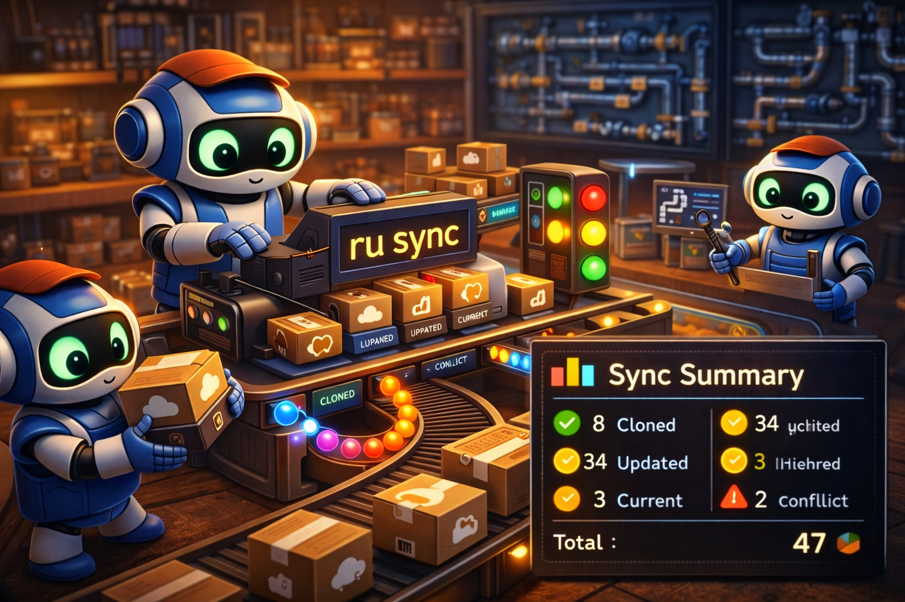

<p align="center">
  
  
  
  
</p>

<h1 align="center">ru</h1>
<h3 align="center">Repo Updater</h3>

<div align="center">
  
</div>

<p align="center">
  <strong>A beautiful, automation-friendly CLI for synchronizing GitHub repositories</strong>
</p>

<p align="center">
  Keep dozens (or hundreds) of repos in sync with a single command.<br/>
  Clone missing repos, pull updates, detect conflicts, and get actionable resolution commands.
</p>

<p align="center">
  <em>Pure Bash with no string parsing of git output. Uses git plumbing for reliable status detection.<br/>
  Meaningful exit codes for CI. JSON output for scripting. Non-interactive mode for automation.</em>
</p>

---

<p align="center">

```bash
curl -fsSL "https://raw.githubusercontent.com/joyshmitz/repo_updater/main/install.sh?ru_cb=$(date +%s)" | bash
# You can omit the `?ru_cb=...` once installed; it's just a cache-buster for the installer fetch.
```

</p>

> [!IMPORTANT]
> **Upstream decision (Issue #1): fork management will not be merged upstream (`won't fix`).**
> This fork (`joyshmitz/repo_updater`) is the maintained distribution for `fork-status`, `fork-sync`, and `fork-clean`.
>
> - Upstream issue: https://github.com/Dicklesworthstone/repo_updater/issues/1
> - Install this fork: `curl -fsSL "https://raw.githubusercontent.com/joyshmitz/repo_updater/main/install.sh?ru_cb=$(date +%s)" | bash`

---

## 🤖 Agent Quickstart (JSON/TOON)

**Use structured output in agent contexts.** stdout = data, stderr = diagnostics, exit 0 = success.

```bash
# Sync all repos (machine-readable)
ru sync --format json

# Preview without changes
ru sync --dry-run --format json

# Status only (no fetch)
ru status --no-fetch --format json
```

## 🤖 Ready-made Blurb for AI Agents

> [!IMPORTANT]
> **Copy the blurb below to your project's `AGENTS.md`, `CLAUDE.md`, or `.cursorrules` file for AI agent integration with ru.**

````markdown
## ru Quick Reference for AI Agents

Syncs GitHub repos to local projects directory (clone missing, pull updates, detect conflicts).

```bash
ru sync                    # Sync all repos
ru sync --dry-run          # Preview only
ru sync -j4 --autostash    # Parallel + auto-stash
ru status --no-fetch       # Quick local status
ru list --paths            # Repo paths (stdout)
```

**Automation:** `--non-interactive --format json|toon` (structured→stdout, human→stderr). (`--json` == `--format json`)

**Exit:** 0=ok | 1=partial | 2=conflicts | 3=system | 4=bad args | 5=interrupted (`--resume`)

**Critical:**
- Never create worktrees/clones in projects dir → use `/tmp/`
- Never parse human output → use `--format json|toon`
````

---

## 🎯 The Primary Use Case: Keeping Your Projects Directory in Sync

**The scenario:** You work across multiple machines, contribute to dozens of repositories, and your local `/data/projects` directory needs to stay synchronized with GitHub. Manually running `git pull` in each directory is tedious and error-prone.

```
┌─────────────────┐     ┌─────────────────┐     ┌─────────────────┐
│  Your Repos     │     │  repos.d/       │     │       ru        │
│  on GitHub      │────▶│  public.txt     │────▶│     sync        │
│  (47 repos)     │     │  private.txt    │     │                 │
└─────────────────┘     └─────────────────┘     └─────────────────┘
                                                        │
         ┌──────────────────────────────────────────────┤
         ▼                    ▼                         ▼
┌─────────────────┐  ┌─────────────────┐     ┌─────────────────┐
│  Clone Missing  │  │  Pull Updates   │     │  Report Status  │
│  (8 new repos)  │  │  (34 updated)   │     │  (2 conflicts)  │
└─────────────────┘  └─────────────────┘     └─────────────────┘
                                                        │
                                                        ▼
                                             ┌─────────────────┐
                                             │  Actionable     │
                                             │  Resolution     │
                                             │  Commands       │
                                             └─────────────────┘
```

**The workflow:**

1. **Configure once** — Add repos to `~/.config/ru/repos.d/public.txt`
2. **Run `ru sync`** — Everything happens automatically
3. **Review conflicts** — Get copy-paste commands to resolve issues

```bash
# On any machine, sync all 47 of your repos
ru sync

# Output:
# → Processing 1/47: mcp_agent_mail
#   ├─ Path: /data/projects/mcp_agent_mail
#   ├─ Status: behind (0 ahead, 3 behind)
#   └─ Result: ✓ Updated (2s)
#
# ╭─────────────────────────────────────────────────────────────╮
# │                    📊 Sync Summary                          │
# │  ✅ Cloned:     8 repos                                     │
# │  ✅ Updated:   34 repos                                     │
# │  ⏭️  Current:    3 repos                                    │
# │  ⚠️  Conflicts: 2 repos (need attention)                    │
# │  Total: 47 repos processed in 2m 34s                        │
# ╰─────────────────────────────────────────────────────────────╯
```

**Comparison:**

| Without ru | With ru |
|------------|---------|
| `cd` into each of 47 directories and `git pull` | One command syncs everything |
| Forget which repos exist locally vs remotely | Automatically clones missing repos |
| Wonder if your local branch diverged | Clear status: behind, ahead, diverged, conflict |
| Google the right git commands for conflicts | Copy-paste resolution commands provided |
| Manual process breaks when network fails | Meaningful exit codes for scripting |

---

## Table of Contents

- [Ready-made Blurb for AI Agents](#-ready-made-blurb-for-ai-agents)
- [The Primary Use Case](#-the-primary-use-case-keeping-your-projects-directory-in-sync)
- [Why ru Exists](#-why-ru-exists)
- [Highlights](#-highlights)
- [Quickstart](#-quickstart)
- [Commands](#-commands)
- [Configuration](#-configuration)
- [Repo List Format](#-repo-list-format)
  - [Path Collision Detection](#path-collision-detection)
- [Sync Workflow](#-sync-workflow)
  - [Parallel Sync](#parallel-sync)
  - [Network Timeout Tuning](#network-timeout-tuning)
  - [Resuming Interrupted Syncs](#resuming-interrupted-syncs)
- [Git Status Detection](#-git-status-detection)
- [Conflict Resolution](#-conflict-resolution)
- [Managing Orphan Repositories](#-managing-orphan-repositories)
- [Output Modes](#-output-modes)
- [AI-Assisted Code Review](#-ai-assisted-code-review)
  - [Priority Scoring Algorithm](#priority-scoring-algorithm)
  - [Session Drivers](#session-drivers)
    - [ntm Integration](#ntm-named-tmux-manager-integration)
  - [Claude Code Integration](#claude-code-integration)
  - [Git Worktree Isolation](#git-worktree-isolation)
  - [GitHub Actions Execution](#github-actions-execution)
  - [Review Policies](#review-policies)
  - [GraphQL Batch Querying](#graphql-batch-querying)
  - [Rate-Limit Governor](#rate-limit-governor)
  - [Global Backoff Coordination](#global-backoff-coordination)
  - [Quality Gates](#quality-gates)
  - [Session Health Monitoring](#session-health-monitoring)
- [Agent-Driven Sweep](#-agent-driven-sweep)
  - [Prerequisites](#agent-sweep-prerequisites)
  - [Basic Usage](#basic-usage)
  - [Preflight Checks](#preflight-checks)
  - [Security Guardrails](#security-guardrails)
  - [Per-Repository Configuration](#per-repository-configuration)
  - [State Management](#state-management)
  - [Troubleshooting Agent Sweep](#troubleshooting-agent-sweep)
- [Dependency Updates](#-dependency-updates)
  - [Supported Package Managers](#supported-package-managers)
  - [Update Workflow](#update-workflow)
  - [Filtering Dependencies](#filtering-dependencies)
- [Exit Codes](#-exit-codes)
- [Architecture](#-architecture)
  - [NDJSON Results Logging](#ndjson-results-logging)
  - [Portable Locking](#portable-locking)
  - [Work-Stealing Queue](#work-stealing-queue)
  - [Path Security Validation](#path-security-validation)
  - [Retry with Exponential Backoff](#retry-with-exponential-backoff)
- [Design Principles](#-design-principles)
- [File Denylist System](#️-file-denylist-system)
- [Testing](#-testing)
- [Troubleshooting](#-troubleshooting)
- [Environment Variables](#-environment-variables)
- [Dependencies](#-dependencies)
- [Security & Privacy](#-security--privacy)
- [Uninstallation](#-uninstallation)
- [Contributing](#-contributing)
- [License](#-license)

---

## 💡 Why ru Exists

Managing a large collection of GitHub repositories presents unique challenges:

| Problem | Why It's Hard | How ru Solves It |
|---------|---------------|------------------|
| **Too many repos to update manually** | 47 repos × `cd` + `git pull` = wasted time | One command syncs everything |
| **New repos on GitHub not cloned locally** | No way to detect missing repos automatically | Compares list to local directory, clones missing |
| **Diverged branches are confusing** | "Already up to date" vs actual divergence | Git plumbing detects ahead/behind/diverged states |
| **Dirty working trees block pulls** | Errors with uncommitted changes | Clear warnings + resolution commands |
| **Different clone strategies per repo** | Some need SSH, some HTTPS, some specific branches | Flexible repo spec syntax (`repo@branch`) |
| **Need automation in CI** | Interactive prompts break scripts | `--non-interactive` mode, JSON output, exit codes |
| **Public vs private repos** | Different auth requirements | Separate lists, automatic `gh` CLI integration |

ru brings order to your projects directory. It's the tool you wish existed every time you've thought "I should really update all my repos."

---

## ✨ Highlights

<table>
<tr>
<td width="50%">

### Zero-Setup Installation
One-liner installer handles everything:
- Checksum verification by default
- Auto-installs to `~/.local/bin`
- Detects missing `gh` CLI and prompts
- XDG-compliant configuration

</td>
<td width="50%">

### Automation-Grade Design
Built for scripting and CI from day one:
- Meaningful exit codes (0-5)
- `--json` mode for structured output
- `--non-interactive` for unattended runs
- `--dry-run` to preview changes

</td>
</tr>
<tr>
<td width="50%">

### Git Plumbing, Not String Parsing
Reliable status detection:
- `git rev-list --left-right` for ahead/behind
- `git status --porcelain` for dirty detection
- Never parses "Already up to date" text
- Locale-independent, version-safe

</td>
<td width="50%">

### Beautiful Terminal UI
Powered by [gum](https://github.com/charmbracelet/gum) with ANSI fallbacks:
- Styled progress indicators
- Boxed summary reports
- Color-coded status (green/yellow/red)
- Works without gum installed

</td>
</tr>
<tr>
<td width="50%">

### Subcommand Architecture
Clean CLI with focused commands:
- `sync` — Clone and pull repos
- `status` — Show status without changes
- `init` — Create configuration
- `add` — Add repo to list
- `doctor` — System diagnostics

</td>
<td width="50%">

### Conflict Resolution Help
Actionable commands for every issue:
- Dirty working tree? Stash/commit/discard options
- Diverged branches? Rebase/merge/push options
- Auth failed? Token/login instructions
- Copy-paste ready commands

</td>
</tr>
<tr>
<td width="50%">

### Parallel & Resumable Syncs
Efficient handling of large repo collections:
- `--parallel N` for concurrent operations
- Worker pool with portable coordination
- `--resume` to continue interrupted syncs
- State tracking for reliable restarts

</td>
<td width="50%">

### Orphan Repository Management
Keep your projects directory clean:
- `ru prune` detects orphan repositories
- `--archive` for non-destructive cleanup
- Layout-aware directory scanning
- Respects custom-named repos in config

</td>
</tr>
</table>

---

## ⚡ Quickstart

### Installation

#### Recommended: Install Script

```bash
curl -fsSL "https://raw.githubusercontent.com/joyshmitz/repo_updater/main/install.sh?ru_cb=$(date +%s)" | bash
```

**If you suspect CDN caching (stale installer):**
```bash
curl -fsSL "https://raw.githubusercontent.com/joyshmitz/repo_updater/main/install.sh?ru_cb=$(date +%s).$$" | bash
```

**How cache-busting works:**

GitHub's raw content is served through a CDN that caches aggressively. The `?ru_cb=...` query parameter ensures fresh content:

| Technique | Cache Bypass |
|-----------|-------------|
| `$(date +%s)` | Unix timestamp (changes every second) |
| `$(date +%s).$$` | Timestamp + PID (unique per invocation) |
| `RU_CACHE_BUST_TOKEN=xyz` | Custom token override |

**Installer self-refresh mechanism:**

When the installer runs via `curl | bash`, it performs automatic self-refresh to ensure you always get the latest version:

```
┌─────────────────────────────────────────────────────────────────┐
│                   Installer Self-Refresh                          │
└─────────────────────────────────────────────────────────────────┘
                              │
                              ▼
                    ┌─────────────────┐
                    │  Detect piped   │◀─────── stdin is not a TTY?
                    │  execution      │
                    └────────┬────────┘
                             │ yes
                             ▼
                    ┌─────────────────┐
                    │  Download fresh │◀─────── Fetch latest install.sh
                    │  installer      │         to temp file
                    └────────┬────────┘
                             │
                             ▼
                    ┌─────────────────┐
                    │  Validate       │◀─────── Check #!/usr/bin/env bash
                    │  shebang        │         header is present
                    └────────┬────────┘
                             │ valid
                             ▼
                    ┌─────────────────┐
                    │  Re-exec with   │◀─────── RU_INSTALLER_REFRESHED=1
                    │  fresh copy     │         prevents infinite loop
                    └─────────────────┘
```

This ensures that even if CDN caching serves a stale version initially, the installer will fetch and execute the latest code. The `RU_INSTALLER_REFRESHED=1` environment variable prevents recursion.

To disable self-refresh (for airgapped environments):
```bash
RU_INSTALLER_NO_SELF_REFRESH=1 bash install.sh
```

<details>
<summary><strong>Manual installation</strong></summary>

```bash
# Download script
curl -fsSL https://raw.githubusercontent.com/joyshmitz/repo_updater/main/ru -o ~/.local/bin/ru
chmod +x ~/.local/bin/ru

# Ensure ~/.local/bin is in PATH
echo 'export PATH="$HOME/.local/bin:$PATH"' >> ~/.zshrc  # or ~/.bashrc
source ~/.zshrc
```

</details>

<details>
<summary><strong>Installation options</strong></summary>

```bash
# Custom install directory
DEST=/opt/bin curl -fsSL .../install.sh | bash

# System-wide installation (requires sudo)
RU_SYSTEM=1 curl -fsSL .../install.sh | bash

# Install specific version
RU_VERSION=1.0.0 curl -fsSL .../install.sh | bash

# Install from main branch (not recommended for production)
RU_UNSAFE_MAIN=1 curl -fsSL .../install.sh | bash
```

</details>

### First Run

```bash
# Initialize configuration
ru init

# Add some repos
ru add Dicklesworthstone/mcp_agent_mail
ru add Dicklesworthstone/beads_viewer

# Sync everything
ru sync
```

---

## 🛠️ Commands

```
ru [command] [options]
```

### Available Commands

| Command | Description |
|---------|-------------|
| `sync` | Clone missing repos and pull updates (default) |
| `status` | Show repository status without making changes |
| `init` | Initialize configuration directory and files |
| `add <repo>` | Add a repository to your list |
| `remove <repo>` | Remove a repository from your list |
| `list` | Show configured repositories |
| `doctor` | Run system diagnostics |
| `self-update` | Update ru to the latest version |
| `config` | Show or set configuration values |
| `prune` | Find and manage orphan repositories |
| `review` | AI-assisted code review orchestration |
| `agent-sweep` | Orchestrate AI agents across dirty repos |
| `dep-update` | AI-powered dependency updates across repos |
| `import` | Import repos from GitHub stars or org |

### Global Options

| Flag | Description |
|------|-------------|
| `--help`, `-h` | Show help message |
| `--version`, `-v` | Show version |
| `--json` | Output JSON to stdout (human output still goes to stderr) |
| `--quiet`, `-q` | Minimal output (errors only) |
| `--verbose` | Detailed output |
| `--non-interactive` | Never prompt (for CI/automation) |

### Command-Specific Options

**`ru sync`**
| Flag | Description |
|------|-------------|
| `--clone-only` | Only clone missing repos, don't pull |
| `--pull-only` | Only pull existing repos, don't clone |
| `--autostash` | Stash changes before pull, pop after |
| `--rebase` | Use `git pull --rebase` instead of merge |
| `--dry-run` | Show what would happen without making changes |
| `--dir PATH` | Override projects directory |
| `--parallel N`, `-j N` | Sync N repos concurrently (default: 1) |
| `--timeout SECONDS` | Network timeout for slow operations (default: 30) |
| `--resume` | Resume an interrupted sync from where it left off |
| `--restart` | Discard interrupted sync state and start fresh |

**Ad-hoc sync:** You can also pass repo URLs directly without adding them to config:
```bash
ru sync owner/repo1 owner/repo2 https://github.com/owner/repo3
```

**`ru status`**
| Flag | Description |
|------|-------------|
| `--fetch` | Fetch remotes first (default) |
| `--no-fetch` | Skip fetch, use cached state |

**`ru add`**
| Flag | Description |
|------|-------------|
| `--private` | Add to private repos list |
| `--public` | Add to public repos list (default) |
| `--from-cwd` | Detect repo from current directory's git remote |

**`ru remove`**
| Flag | Description |
|------|-------------|
| `--private` | Remove from private repos list only |
| `--public` | Remove from public repos list only |
| (none) | Search and remove from all repo lists |

**`ru list`**
| Flag | Description |
|------|-------------|
| `--public` | Show only public repos |
| `--private` | Show only private repos |
| `--paths` | Show local paths instead of URLs |

**`ru init`**
| Flag | Description |
|------|-------------|
| `--example` | Populate repos.txt with example repositories |

**`ru self-update`**
| Flag | Description |
|------|-------------|
| `--check` | Check for updates without installing |

**`ru config`**
| Flag | Description |
|------|-------------|
| `--print` | Print all configuration values |
| `--set KEY=VALUE` | Set a configuration value |

**`ru prune`**
| Flag | Description |
|------|-------------|
| (none) | List orphan repos (dry run, default) |
| `--archive` | Move orphan repos to archive directory |
| `--delete` | Permanently delete orphan repos (requires confirmation) |

**`ru review`**
| Flag | Description |
|------|-------------|
| `--plan` | Discovery mode: find work items and plan review (default) |
| `--apply` | Apply mode: process approved changes from a previous plan |
| `--dry-run` | Show what would be discovered without starting sessions |
| `--status` | Show current review state without running discovery |
| `--analytics` | Display analytics dashboard for past reviews |
| `--basic` | Use basic TUI instead of terminal multiplexer |
| `--mode=MODE` | Session driver: `auto`, `ntm`, or `local` |
| `--parallel N`, `-j N` | Run N review sessions concurrently (default: 4) |
| `--repos=PATTERN` | Filter repos by pattern (glob or regex) |
| `--priority=LEVEL` | Minimum priority threshold: `critical`, `high`, `normal`, `low`, `all` |
| `--skip-days=N` | Skip items reviewed within N days (default: 7) |
| `--max-repos=N` | Limit number of repos to review (cost budget) |
| `--max-runtime=N` | Maximum runtime in minutes (time budget) |
| `--resume` | Resume an interrupted review session |
| `--push` | Allow pushing changes (with `--apply`) |

**`ru import`**
| Flag | Description |
|------|-------------|
| `--stars` | Import from your GitHub stars |
| `--org=NAME` | Import from an organization |
| `--user=NAME` | Import from a user's repos |
| `--limit=N` | Maximum repos to import |
| `--private` | Add to private repos list |

**`ru agent-sweep`**
| Flag | Description |
|------|-------------|
| `--dry-run` | Preview which repos would be processed |
| `--parallel N`, `-jN` | Process N repos concurrently (default: 1) |
| `--repos=PATTERN` | Filter repos by glob pattern |
| `--with-release` | Include release step after commit |
| `--resume` | Resume an interrupted sweep |
| `--restart` | Clear previous state and start fresh |
| `--keep-sessions` | Keep tmux sessions after completion |
| `--keep-sessions-on-fail` | Keep sessions only on failure |
| `--attach-on-fail` | Attach to session on failure |
| `--execution-mode=MODE` | Mode: `plan`, `apply`, or `agent` (default: agent) |
| `--secret-scan=MODE` | Secret scanning: `none`, `warn`, `block` (default: warn) |
| `--phase1-timeout=N` | Phase 1 timeout in seconds (default: 300) |
| `--phase2-timeout=N` | Phase 2 timeout in seconds (default: 600) |
| `--phase3-timeout=N` | Phase 3 timeout in seconds (default: 300) |
| `--json` | Output results as JSON |
| `--verbose`, `-v` | Verbose output |
| `--debug`, `-d` | Debug output (implies verbose) |

**`ru dep-update`**
| Flag | Description |
|------|-------------|
| `--dry-run` | Show what would be updated (no changes) |
| `--manager=NAME` | Only update deps for specific manager (npm, pip, cargo, etc.) |
| `--include=PATTERN` | Only update deps matching regex pattern |
| `--exclude=PATTERN` | Skip deps matching regex pattern |
| `--major` | Include major version updates (default: skip major) |
| `--test-cmd=CMD` | Custom test command (overrides auto-detection) |
| `--max-fix-attempts=N` | Max fix iterations per dependency (default: 5) |
| `--no-push` | Commit changes but don't push to remote |
| `--repo=PATH` | Process single repo only (default: all repos) |
| `--agent=TYPE` | Agent type: `claude` (default), `codex`, `gemini` |
| `--timeout=SEC` | Per-repo timeout in seconds (default: 900) |

---

## ⚙️ Configuration

ru uses [XDG Base Directory Specification](https://specifications.freedesktop.org/basedir-spec/basedir-spec-latest.html) for configuration.

### Directory Structure

```
~/.config/ru/
├── config                    # Main configuration file
└── repos.d/
    ├── public.txt            # Public repositories
    └── private.txt           # Private repositories

~/.cache/ru/
└── (runtime cache)

~/.local/state/ru/
├── logs/
│   ├── 2025-01-03/
│   │   ├── run.log           # Main run log
│   │   └── repos/
│   │       ├── mcp_agent_mail.log
│   │       └── beads_viewer.log
│   └── latest -> 2025-01-03  # Symlink to latest run
└── archived/                 # Orphan repos (from ru prune)
```

### Configuration File

```bash
# ~/.config/ru/config

# Base directory for repositories
PROJECTS_DIR=/data/projects

# Directory layout: flat | owner-repo | full
#   flat:       $PROJECTS_DIR/repo
#   owner-repo: $PROJECTS_DIR/owner/repo
#   full:       $PROJECTS_DIR/github.com/owner/repo
LAYOUT=flat

# Update strategy: ff-only | rebase | merge
UPDATE_STRATEGY=ff-only

# Auto-stash local changes before pull
AUTOSTASH=false

# Parallel operations (1 = serial)
PARALLEL=1

# Network timeout in seconds (for slow connections)
TIMEOUT=30

# Check for ru updates on run
CHECK_UPDATES=false
```

### Configuration Resolution

Priority (highest to lowest):
1. Command-line arguments (`--dir`, `--rebase`, etc.)
2. Environment variables (`RU_PROJECTS_DIR`, `RU_LAYOUT`, etc.)
3. Config file (`~/.config/ru/config`)
4. Built-in defaults

---

## 📝 Repo List Format

### Basic Format

```bash
# ~/.config/ru/repos.d/public.txt
# Lines starting with # are comments
# Empty lines are ignored

# Full URL
https://github.com/owner/repo

# Shorthand (assumes github.com)
owner/repo

# Pin to specific branch or tag
owner/repo@develop
owner/repo@v2.0.1

# Custom local directory name
owner/repo as custom-name

# Combined: branch + custom name
owner/repo@develop as dev-version

# SSH URL format
git@github.com:owner/repo.git

# SSH with custom name
git@github.com:owner/repo.git as myrepo
```

### Advanced Repo Spec Syntax

The repo spec parser supports flexible combinations:

```
<url_or_shorthand>[@<branch>] [as <local_name>]
```

| Spec | URL | Branch | Local Name |
|------|-----|--------|------------|
| `owner/repo` | `owner/repo` | (default) | `repo` |
| `owner/repo@develop` | `owner/repo` | `develop` | `repo` |
| `owner/repo as myrepo` | `owner/repo` | (default) | `myrepo` |
| `owner/repo@v2 as stable` | `owner/repo` | `v2` | `stable` |
| `git@github.com:o/r.git` | `git@github.com:o/r.git` | (default) | `r` |
| `git@github.com:o/r.git as x` | `git@github.com:o/r.git` | (default) | `x` |

**Notes:**
- The `@branch` specifier must come before `as name`
- Branch names cannot contain `/` (use `v2` not `feature/v2`)
- The SSH `@` in `git@github.com` is not confused with branch syntax
- Custom names are case-sensitive and become the directory name

### Supported URL Formats

All of these are equivalent:

```
https://github.com/owner/repo
https://github.com/owner/repo.git
git@github.com:owner/repo.git
github.com/owner/repo
owner/repo
```

### Path Layout Examples

| Layout | Input | Local Path |
|--------|-------|------------|
| `flat` | `Dicklesworthstone/mcp_agent_mail` | `/data/projects/mcp_agent_mail` |
| `owner-repo` | `Dicklesworthstone/mcp_agent_mail` | `/data/projects/Dicklesworthstone/mcp_agent_mail` |
| `full` | `Dicklesworthstone/mcp_agent_mail` | `/data/projects/github.com/Dicklesworthstone/mcp_agent_mail` |

> **Note:** `flat` layout is the default for backwards compatibility with existing `/data/projects` structures. Use `owner-repo` if you have repos with the same name from different owners.

### Path Collision Detection

When using `flat` layout, different owners may have repositories with the same name. ru automatically detects these collisions:

```
⚠️  Path collision detected:
    user1/myapp -> /data/projects/myapp
    user2/myapp -> /data/projects/myapp

Only the first repository will be synced to this path.
Consider using: ru config --set LAYOUT=owner-repo
```

**How collision detection works:**

1. Before syncing, ru resolves all repo URLs to local paths
2. If multiple repos resolve to the same path, a warning is shown
3. The first occurrence in your config wins (subsequent duplicates are skipped)
4. Using `owner-repo` or `full` layout eliminates collisions

**Resolution options:**
- Use `owner-repo` layout: `ru config --set LAYOUT=owner-repo`
- Use custom names: `user2/myapp as myapp-user2`
- Remove the duplicate from your config

---

## 🔄 Sync Workflow

### What `ru sync` Does

```
┌─────────────────────────────────────────────────────────────────┐
│                        ru sync                                   │
└─────────────────────────────────────────────────────────────────┘
                              │
                              ▼
                    ┌─────────────────┐
                    │  Load repo      │
                    │  lists          │
                    └────────┬────────┘
                             │
                             ▼
                    ┌─────────────────┐
                    │  For each repo: │
                    └────────┬────────┘
                             │
              ┌──────────────┼──────────────┐
              ▼              ▼              ▼
       ┌──────────┐   ┌──────────┐   ┌──────────┐
       │ Missing? │   │ Exists?  │   │ Mismatch?│
       │ → Clone  │   │ → Pull   │   │ → Warn   │
       └──────────┘   └──────────┘   └──────────┘
                             │
                             ▼
                    ┌─────────────────┐
                    │  Check status   │
                    │  (plumbing)     │
                    └────────┬────────┘
                             │
         ┌───────────────────┼───────────────────┐
         ▼                   ▼                   ▼
  ┌────────────┐     ┌────────────┐     ┌────────────┐
  │  current   │     │  behind    │     │  diverged  │
  │  → Skip    │     │  → Pull    │     │  → Report  │
  └────────────┘     └────────────┘     └────────────┘
                             │
                             ▼
                    ┌─────────────────┐
                    │  Write result   │
                    │  to log         │
                    └────────┬────────┘
                             │
                             ▼
                    ┌─────────────────┐
                    │  Print summary  │
                    │  + exit code    │
                    └─────────────────┘
```

### Per-Repo Processing

For each repository in your lists:

1. **Parse URL** — Extract host, owner, repo name
2. **Compute local path** — Based on layout configuration
3. **Check existence** — Does the directory exist?
4. **If missing** → Clone with `gh repo clone`
5. **If exists** → Verify remote URL matches, then check status
6. **Get status** — Using git plumbing (ahead/behind/dirty)
7. **Take action** — Pull if behind, skip if current, warn if diverged
8. **Log result** — Per-repo log file + NDJSON result

### Parallel Sync

When syncing many repositories, parallel execution can significantly reduce total sync time:

```bash
# Sync 4 repos at a time
ru sync --parallel 4

# Or use the short form
ru sync -j 8
```

**How it works:**

1. **Worker pool** — ru spawns N worker processes (specified by `--parallel` or `-j`)
2. **Job queue** — Repositories are distributed among workers as they become available
3. **Portable coordination** — Directory-based locking prevents race conditions in shared resources
4. **Aggregated results** — All worker results are collected and reported in a unified summary

```
┌─────────────────────────────────────────────────────────────────┐
│                     ru sync --parallel 4                         │
└─────────────────────────────────────────────────────────────────┘
                              │
               ┌──────────────┼──────────────┐
               ▼              ▼              ▼              ▼
        ┌──────────┐   ┌──────────┐   ┌──────────┐   ┌──────────┐
        │ Worker 1 │   │ Worker 2 │   │ Worker 3 │   │ Worker 4 │
        │ repo A   │   │ repo B   │   │ repo C   │   │ repo D   │
        │ repo E   │   │ repo F   │   │ repo G   │   │ repo H   │
        │   ...    │   │   ...    │   │   ...    │   │   ...    │
        └──────────┘   └──────────┘   └──────────┘   └──────────┘
               │              │              │              │
               └──────────────┴──────────────┴──────────────┘
                              │
                              ▼
                    ┌─────────────────┐
                    │  Unified        │
                    │  Summary        │
                    └─────────────────┘
```

**Configuration:**
```bash
# Set default parallelism in config
ru config --set PARALLEL=4

# Or use environment variable
export RU_PARALLEL=4
```

**Requirements:**
- None (portable locking is built in)

### Network Timeout Tuning

For slow or unreliable networks, ru provides timeout configuration to prevent hangs:

```bash
# Command-line override
ru sync --timeout 60

# Config file
# ~/.config/ru/config
TIMEOUT=60

# Environment variable
export RU_TIMEOUT=60
```

**Advanced tuning via git environment:**

| Variable | Default | Purpose |
|----------|---------|---------|
| `GIT_TIMEOUT` | 30 | Overall network timeout in seconds |
| `GIT_LOW_SPEED_LIMIT` | 1000 | Abort if transfer falls below this bytes/second |

```bash
# For very slow connections
GIT_TIMEOUT=120 GIT_LOW_SPEED_LIMIT=100 ru sync
```

**Timeout error detection:**

ru automatically recognizes timeout-related errors:
- "RPC failed"
- "timed out"
- "remote end hung up unexpectedly"
- "transfer rate too slow"

When a timeout is detected, the conflict resolution output provides retry suggestions.

### Resuming Interrupted Syncs

If a sync is interrupted (Ctrl+C, network failure, etc.), ru saves progress state and can resume where it left off:

```bash
# Start a large sync
ru sync
# ^C (interrupted)
# Exit code: 5

# Resume from where you left off
ru sync --resume

# Or discard state and start fresh
ru sync --restart
```

**How state tracking works:**

1. **State file** — Progress is saved to `~/.local/state/ru/sync_state.json`
2. **Atomic updates** — State is updated after each repo completes
3. **Safe resume** — On `--resume`, already-completed repos are skipped
4. **Clean restart** — `--restart` clears state and processes all repos fresh

**State file contents:**
```json
{
  "started_at": "2025-01-03T14:30:00Z",
  "repos_completed": ["repo1", "repo2", "repo3"],
  "repos_pending": ["repo4", "repo5", "..."],
  "last_repo": "repo3",
  "interrupted": true
}
```

**Best practices:**
- Use `--resume` when you want to continue after an interruption
- Use `--restart` when the repo list has changed significantly
- In CI, prefer `--restart` to ensure consistent runs

---

## 🔬 Git Status Detection

ru uses git plumbing commands for reliable status detection, never parsing human-readable output.

### Why Plumbing Matters

**Fragile approach (what other tools do):**
```bash
# This breaks with non-English locales!
if git pull 2>&1 | grep -q "Already up to date"; then
    echo "Current"
fi
```

**Robust approach (what ru does):**
```bash
# Works regardless of locale or git version
read -r ahead behind < <(git rev-list --left-right --count HEAD...@{u})
if [[ "$ahead" -eq 0 && "$behind" -eq 0 ]]; then
    echo "Current"
fi
```

### Status States

| State | Ahead | Behind | Meaning |
|-------|-------|--------|---------|
| `current` | 0 | 0 | Fully synchronized |
| `behind` | 0 | >0 | Remote has new commits |
| `ahead` | >0 | 0 | Local has unpushed commits |
| `diverged` | >0 | >0 | Both have new commits |
| `dirty` | — | — | Uncommitted local changes |
| `no_upstream` | — | — | No tracking branch set |

### Dirty Detection

```bash
# Empty output = clean working tree
if [[ -n $(git -C "$repo_path" status --porcelain 2>/dev/null) ]]; then
    dirty="true"
fi
```

---

## 🚨 Conflict Resolution

When ru encounters issues, it provides actionable resolution commands.

### Example Output

```
╭─────────────────────────────────────────────────────────────╮
│  ⚠️  Repositories Needing Attention                         │
╰─────────────────────────────────────────────────────────────╯

1. mcp_agent_mail
   Path:   /data/projects/mcp_agent_mail
   Branch: main
   Issue:  Dirty working tree (3 files modified)
   Log:    ~/.local/state/ru/logs/2025-01-03/repos/mcp_agent_mail.log

   Resolution options:
     a) Stash and pull:
        cd /data/projects/mcp_agent_mail && git stash && git pull && git stash pop

     b) Commit your changes:
        cd /data/projects/mcp_agent_mail && git add . && git commit -m "WIP"

     c) Discard local changes (DESTRUCTIVE):
        cd /data/projects/mcp_agent_mail && git checkout . && git clean -fd

2. beads_viewer
   Path:   /data/projects/beads_viewer
   Branch: main
   Issue:  Diverged (2 ahead, 5 behind)

   Resolution options:
     a) Rebase your changes:
        cd /data/projects/beads_viewer && git pull --rebase

     b) Merge (creates merge commit):
        cd /data/projects/beads_viewer && git pull --no-ff

     c) Push your changes first (if intentional):
        cd /data/projects/beads_viewer && git push
```

### Common Issues and Fixes

| Issue | Cause | Resolution |
|-------|-------|------------|
| Dirty working tree | Uncommitted changes | Stash, commit, or discard |
| Diverged | Local and remote both have commits | Rebase, merge, or push |
| No upstream | Branch doesn't track remote | `git branch --set-upstream-to=origin/main` |
| Remote mismatch | Different repo at same path | Remove directory or update list |
| Auth failed | gh not authenticated | `gh auth login` or set `GH_TOKEN` |

---

## 🧹 Managing Orphan Repositories

Over time, your projects directory may accumulate "orphan" repositories—directories that exist locally but aren't in your configuration. The `ru prune` command helps identify and manage these.

### What is an Orphan?

An orphan is a git repository in your projects directory that:
- Exists as a valid git repository (has `.git` directory)
- Is NOT listed in any of your `repos.d/*.txt` configuration files
- May have been manually cloned, removed from config, or leftover from experiments

### Detection

```bash
# List orphan repositories (dry run)
ru prune

# Output:
# Found 3 orphan repositories:
#   /data/projects/old-experiment
#   /data/projects/manually-cloned
#   /data/projects/removed-from-config
#
# Use --archive to move to archive, or --delete to remove
```

### Archive Mode

Move orphans to a timestamped archive directory instead of deleting:

```bash
ru prune --archive

# Orphans moved to:
# ~/.local/state/ru/archived/old-experiment-2025-01-03-143022/
# ~/.local/state/ru/archived/manually-cloned-2025-01-03-143022/
```

**Benefits of archiving:**
- Non-destructive—repos can be recovered
- Timestamped for audit trail
- Clears your projects directory without losing work

### Delete Mode

Permanently remove orphan repositories:

```bash
# Interactive (asks for confirmation)
ru prune --delete

# Non-interactive (CI-safe, no prompts)
ru --non-interactive prune --delete
```

**Safety measures:**
- Interactive mode requires explicit confirmation
- `--archive` and `--delete` are mutually exclusive
- Only git repositories are considered (plain directories ignored)

### Layout Awareness

Prune respects your configured layout mode:

| Layout | Scan Depth | Example Orphan Path |
|--------|------------|---------------------|
| `flat` | 1 level | `/data/projects/orphan` |
| `owner-repo` | 2 levels | `/data/projects/owner/orphan` |
| `full` | 3 levels | `/data/projects/github.com/owner/orphan` |

### Custom Names

Prune correctly handles custom-named repositories:

```bash
# In repos.d/public.txt:
# owner/long-repository-name as shortname

# The directory 'shortname' is NOT an orphan
# because it matches the custom name in config
```

---

## 📤 Output Modes

### Default: Human-Readable (stderr)

Progress and results go to stderr, paths to stdout:

```bash
ru sync
# stderr: → Processing 1/47: mcp_agent_mail...
# stderr: ╭─────────── Summary ───────────╮
# stdout: /data/projects/mcp_agent_mail
# stdout: /data/projects/beads_viewer
```

### JSON Mode: `--json`

Structured output on stdout for scripting:

```bash
ru sync --json 2>/dev/null
```

```json
{
  "version": "1.2.0",
  "timestamp": "2025-01-03T14:30:00Z",
  "duration_seconds": 154,
  "config": {
    "projects_dir": "/data/projects",
    "layout": "flat",
    "update_strategy": "ff-only"
  },
  "summary": {
    "total": 47,
    "cloned": 8,
    "updated": 34,
    "current": 3,
    "conflicts": 2,
    "failed": 0
  },
  "repos": [
    {
      "name": "mcp_agent_mail",
      "path": "/data/projects/mcp_agent_mail",
      "action": "pull",
      "status": "updated",
      "duration": 2
    }
  ]
}
```

**Parse with jq:**
```bash
# Get paths of all cloned repos
ru sync --json 2>/dev/null | jq -r '.repos[] | select(.action=="clone") | .path'

# Get count of failures
ru sync --json 2>/dev/null | jq '.summary.failed'
```

### Quiet Mode: `--quiet`

Only errors to stderr, still outputs paths to stdout:

```bash
ru sync --quiet
# Only shows errors, no progress
```

---

## 🤖 AI-Assisted Code Review

ru includes a powerful review orchestration system for managing AI-assisted code review across your repositories. It discovers open issues and pull requests, prioritizes them intelligently, and coordinates review sessions using Claude Code or other AI assistants.

### The Review Workflow

```
┌─────────────────────────────────────────────────────────────────┐
│                       ru review --plan                           │
└─────────────────────────────────────────────────────────────────┘
                              │
              ┌───────────────┼───────────────┐
              ▼               ▼               ▼
       ┌──────────┐    ┌──────────┐    ┌──────────┐
       │  GraphQL │    │  Parse   │    │  Cache   │
       │  Batch   │    │  Work    │    │  Digest  │
       │  Query   │    │  Items   │    │  Check   │
       └──────────┘    └──────────┘    └──────────┘
              │               │               │
              └───────────────┼───────────────┘
                              ▼
                    ┌─────────────────┐
                    │  Priority       │
                    │  Scoring        │
                    └────────┬────────┘
                             │
              ┌──────────────┼──────────────┐
              ▼              ▼              ▼
       ┌──────────┐   ┌──────────┐   ┌──────────┐
       │ CRITICAL │   │   HIGH   │   │  NORMAL  │
       │ security │   │   bugs   │   │ features │
       │ bugs >60d│   │ bugs >30d│   │          │
       └──────────┘   └──────────┘   └──────────┘
                              │
                              ▼
                    ┌─────────────────┐
                    │  Session Driver │
                    │  (tmux/ntm)     │
                    └────────┬────────┘
                             │
         ┌───────────────────┼───────────────────┐
         ▼                   ▼                   ▼
  ┌────────────┐     ┌────────────┐     ┌────────────┐
  │ Session 1  │     │ Session 2  │     │ Session 3  │
  │ (worktree) │     │ (worktree) │     │ (worktree) │
  └────────────┘     └────────────┘     └────────────┘
```

### Two-Phase Review: Plan then Apply

**Phase 1: Discovery (`--plan`)**
- Queries GitHub for open issues and PRs across all repos
- Scores items by priority using label analysis and age
- Creates isolated git worktrees for safe review
- Spawns Claude Code sessions in terminal multiplexer
- Checkpoints progress for interruption recovery

**Phase 2: Application (`--apply`)**
- Reviews proposed changes from discovery phase
- Runs quality gates (ShellCheck, tests, lint)
- Optionally pushes approved changes (`--push`)
- Archives completed work items

```bash
# Discover and plan reviews
ru review --plan

# After reviewing AI suggestions, apply approved changes
ru review --apply --push
```

### Priority Scoring Algorithm

ru uses a multi-factor scoring system to prioritize work items intelligently:

| Factor | Points | Logic |
|--------|--------|-------|
| **Type** | 0-20 | PRs: +20, Issues: +10, Draft PRs: -15 |
| **Labels** | 0-50 | security/critical: +50, bug/urgent: +30, enhancement: +10 |
| **Age (bugs)** | 0-50 | >60 days: +50, >30 days: +30, >14 days: +15 |
| **Age (features)** | -10 to 0 | Very old (>180 days): -10 (likely stale) |
| **Recency** | 0-15 | Updated <3 days: +15, <7 days: +10 |
| **Staleness** | -20 | Recently reviewed: -20 |

**Priority levels:**
| Score | Level | Meaning |
|-------|-------|---------|
| ≥150 | CRITICAL | Security issues, long-standing bugs |
| ≥100 | HIGH | Bugs, urgent items |
| ≥50 | NORMAL | Regular features and issues |
| <50 | LOW | Backlog items |

### Session Drivers

ru supports multiple backends for managing review sessions:

| Driver | Description | Best For |
|--------|-------------|----------|
| `auto` | Automatically detect best available | Default choice |
| `ntm` | Named Tmux Manager integration | Multi-agent workflows |
| `local` | Direct tmux sessions | Simple setups |

```bash
# Use specific driver
ru review --mode=ntm --plan

# Parallel sessions
ru review -j 4 --plan
```

#### ntm (Named Tmux Manager) Integration

[ntm](https://github.com/dicklesworthstone/ntm) is a tmux session orchestration tool that provides a robot mode API for automated session management. When available, ru uses ntm for enhanced capabilities:

**Robot Mode API Functions:**

| Function | Purpose |
|----------|---------|
| `ntm --robot-spawn` | Create a Claude Code session in a new tmux pane |
| `ntm --robot-send` | Send prompts with chunking for long messages |
| `ntm --robot-wait` | Block until session completes with timeout |
| `ntm --robot-activity` | Query real-time session state (idle/typing/thinking) |
| `ntm --robot-status` | Get status of all managed sessions |
| `ntm --robot-interrupt` | Send Ctrl+C to interrupt long operations |

**Session Lifecycle:**

```
┌───────────────────────────────────────────────────────────────┐
│                    ntm Session Lifecycle                       │
└───────────────────────────────────────────────────────────────┘
        │
        ▼
┌───────────────┐
│ ntm_spawn_    │◀─────── Creates tmux session with Claude Code
│ session()     │         running in isolated worktree
└───────┬───────┘
        │
        ▼
┌───────────────┐
│ ntm_send_     │◀─────── Delivers prompt (auto-chunks if >4KB)
│ prompt()      │         Handles message delivery confirmation
└───────┬───────┘
        │
        ▼
┌───────────────┐
│ ntm_wait_     │◀─────── Polls for completion with timeout
│ completion()  │         Returns JSON with status/duration
└───────┬───────┘
        │
        ▼
┌───────────────┐
│ ntm_kill_     │◀─────── Cleans up session when done
│ session()     │         Idempotent—safe to call on gone sessions
└───────────────┘
```

**Activity State Mapping:**

ntm reports granular activity states that ru maps to unified states:

| ntm State | ru Unified State | Meaning |
|-----------|-----------------|---------|
| `IDLE` | `idle` | Session waiting for input |
| `TYPING` | `active` | User/agent is typing |
| `THINKING` | `active` | AI processing |
| `TOOL_USE` | `active` | Executing tool calls |
| `COMPLETE` | `done` | Session finished |
| `ERROR` | `error` | Something went wrong |

**Fallback Behavior:**

When ntm is not available, ru falls back to the `local` driver which uses raw tmux commands. The local driver provides the same core functionality but without:
- Message chunking for long prompts
- Activity state detection
- Delivery confirmation

### Claude Code Integration

ru orchestrates AI review sessions using Claude Code with stream-json output parsing:

```
┌─────────────────────────────────────────────────────────────────┐
│                    Claude Code Session                           │
└─────────────────────────────────────────────────────────────────┘
                              │
                              ▼
                    ┌─────────────────┐
                    │  stream-json    │
                    │  NDJSON output  │
                    └────────┬────────┘
                             │
         ┌───────────────────┼───────────────────┐
         ▼                   ▼                   ▼
   ┌──────────┐       ┌──────────┐       ┌──────────┐
   │  system  │       │ assistant│       │  result  │
   │  events  │       │  events  │       │  events  │
   └──────────┘       └──────────┘       └──────────┘
```

**Event types parsed:**

| Event | Data Extracted |
|-------|----------------|
| `system.init` | Session ID, available tools, working directory |
| `assistant` | Tool uses, text responses, thinking |
| `result` | Status, duration, cost (USD) |

**Interactive question detection:**

When Claude Code uses `AskUserQuestion`, ru detects and surfaces these for human input:

```bash
# Session asks: "Should I refactor this function?"
# ru detects and shows:
#   [Session owner/repo] Question pending: "Should I refactor this function?"
#   Options: 1) Yes  2) No  3) Skip
```

**Cost tracking:**

Each session reports cost, enabling budget enforcement:

```json
{"type":"result","status":"success","duration_ms":45000,"cost_usd":0.0234}
```

### Git Worktree Isolation

Each review session operates in an isolated git worktree, ensuring:
- Main working directory stays untouched
- Multiple reviews can run in parallel
- Changes can be discarded without affecting HEAD
- Clean state for each AI session

```
~/.local/state/ru/worktrees/
└── 20250105-143022-1234/
    ├── owner_repo1/          # Isolated worktree
    ├── owner_repo2/          # Isolated worktree
    └── mapping.json          # Worktree registry
```

### Digest Caching

To avoid redundant API calls and repeated reviews, ru caches repository digests:

```
~/.local/state/ru/review/
├── digests/                  # Cached repo digests
│   ├── owner_repo.json       # Issues/PRs snapshot
│   └── ...
├── state.json                # Current review state
├── checkpoint.json           # Resumable checkpoint
└── results/                  # Review outcomes
    └── 20250105-143022/
        └── results.ndjson    # Per-item results
```

Cache invalidation:
```bash
# Invalidate specific repos
ru review --invalidate-cache=owner/repo1,owner/repo2

# Invalidate all caches
ru review --invalidate-cache=all
```

### Cost Budgets

Control resource usage with budget constraints:

```bash
# Limit to 10 repos
ru review --max-repos=10 --plan

# Maximum 30 minutes runtime
ru review --max-runtime=30 --plan

# Skip recently reviewed items
ru review --skip-days=14 --plan
```

### Review Analytics

View statistics on past reviews:

```bash
ru review --analytics
```

**Metrics tracked:**

```
~/.local/state/ru/metrics/
├── 2025-01.json              # Monthly aggregates
├── 2025-02.json
└── decisions.jsonl           # Per-decision audit log
```

**Monthly metrics:**

| Metric | Description |
|--------|-------------|
| `reviews.total` | Total review sessions started |
| `reviews.repos_reviewed` | Unique repositories reviewed |
| `reviews.issues_processed` | Issues examined by AI |
| `reviews.issues_resolved` | Issues closed or fixed |
| `reviews.questions_asked` | AI questions to human |
| `reviews.questions_answered` | Human responses |
| `timing.total_duration_minutes` | Cumulative review time |
| `timing.avg_session_minutes` | Average session length |
| `outcomes.changes_applied` | Commits made |
| `outcomes.changes_rejected` | Changes discarded |

**Decision logging:**

Every significant action is logged to `decisions.jsonl` for auditability:

```json
{"timestamp":"2025-01-05T14:30:00Z","repo":"owner/repo","issue":42,"action":"close","reason":"Fixed by commit abc123","actor":"ai"}
{"timestamp":"2025-01-05T14:31:00Z","repo":"owner/repo","issue":43,"action":"label","label":"wontfix","actor":"human"}
```

**Analytics dashboard:**

```bash
ru review --analytics
```

Shows:
- Total reviews completed
- Average resolution time
- Most active repositories
- Issue type distribution
- Review velocity trends
- Success/rejection ratios

### GitHub Actions Execution

After review sessions complete, ru can execute planned GitHub actions from the review plan:

```bash
# Actions are proposed during --plan, executed during --apply
ru review --apply
```

**Supported actions:**

| Action | Command | Description |
|--------|---------|-------------|
| `comment` | `gh issue comment` | Add comment to issue/PR |
| `close` | `gh issue close` | Close an issue |
| `label` | `gh issue edit --add-label` | Add labels to issue |

**Idempotent execution:**

Actions are logged and deduplicated to prevent repeated execution:

```
~/.local/state/ru/review/gh_actions.jsonl
```

```json
{"timestamp":"2025-01-05T14:30:00Z","repo":"owner/repo","target":"issue/42","action":"close","status":"success"}
{"timestamp":"2025-01-05T14:30:01Z","repo":"owner/repo","target":"issue/43","action":"comment","status":"success"}
```

If a session is restarted, already-executed actions are skipped automatically.

**Action parsing:**

Actions are extracted from review plan files with canonicalization:

```
owner/repo#42    → repo: owner/repo, type: issue, number: 42
owner/repo/pull/5 → repo: owner/repo, type: pr, number: 5
```

### Review Policies

Configure review behavior with policy files:

```bash
# ~/.config/ru/review/policy.json
{
  "REVIEW_LINT_REQUIRED": true,
  "REVIEW_SECRET_SCAN": true,
  "REVIEW_ALLOW_PUSH": false,
  "REVIEW_REQUIRE_APPROVAL": true,
  "REVIEW_SKIP_PRS": false,
  "REVIEW_DEEP_MODE": false
}
```

| Policy | Default | Description |
|--------|---------|-------------|
| `REVIEW_LINT_REQUIRED` | `true` | Run linters before applying |
| `REVIEW_SECRET_SCAN` | `true` | Scan for secrets in changes |
| `REVIEW_ALLOW_PUSH` | `false` | Allow pushing without `--push` |
| `REVIEW_REQUIRE_APPROVAL` | `true` | Require explicit approval |
| `REVIEW_SKIP_PRS` | `false` | Skip PRs (issues only) |
| `REVIEW_DEEP_MODE` | `false` | Enable deep analysis |

### GraphQL Batch Querying

ru uses efficient GraphQL alias batching to minimize API calls when discovering work items across many repositories:

```
┌─────────────────────────────────────────────────────────────────┐
│                   GraphQL Batch Query                            │
└─────────────────────────────────────────────────────────────────┘
                              │
         ┌────────────────────┼────────────────────┐
         ▼                    ▼                    ▼
   ┌──────────┐         ┌──────────┐         ┌──────────┐
   │  repo0:  │         │  repo1:  │         │  repo24: │
   │  issues  │   ...   │  issues  │   ...   │  issues  │
   │  + PRs   │         │  + PRs   │         │  + PRs   │
   └──────────┘         └──────────┘         └──────────┘
         │                    │                    │
         └────────────────────┼────────────────────┘
                              ▼
                    ┌─────────────────┐
                    │  Single API     │
                    │  Response       │
                    └─────────────────┘
```

**How it works:**

1. **Alias batching** — Up to 25 repositories per GraphQL query using named aliases (`repo0`, `repo1`, ...)
2. **Parallel field fetching** — Issues, PRs, and labels retrieved in one request per batch
3. **Automatic chunking** — Large repo lists split into optimal batch sizes
4. **Retry on failure** — Failed batches retried with exponential backoff

**Efficiency comparison:**

| Approach | 100 Repos | API Calls |
|----------|-----------|-----------|
| Individual REST | 100 repos × 2 (issues + PRs) | 200 calls |
| GraphQL batched | 100 repos ÷ 25 per batch | 4 calls |

### Rate-Limit Governor

ru includes an adaptive parallelism governor that adjusts concurrency based on GitHub API rate limits and error patterns:

```bash
# The governor tracks:
#   - GitHub API remaining quota
#   - Model rate limit (429) responses
#   - Error frequency within sliding window
#   - Circuit breaker state
```

**Adaptive behavior:**

| Condition | Action |
|-----------|--------|
| GitHub remaining < 100 | Reduce parallelism to 1 |
| GitHub remaining < 500 | Reduce parallelism by 50% |
| Model 429 detected | Pause new sessions for 60s |
| Error rate > 50% (5min window) | Open circuit breaker |
| Circuit open > 2 minutes + no errors | Close circuit breaker |

**Circuit breaker pattern:**

```
Normal Operation → Errors Spike → Circuit OPEN → Cool-down → Half-Open → Test → CLOSED
                       ↑                              │
                       └──────── More Errors ─────────┘
```

The governor runs as a background monitor during review sessions, checking rate limits every 30 seconds and adjusting `REVIEW_PARALLEL` dynamically.

### Global Backoff Coordination

When running parallel agent-sweep operations, ru uses a shared backoff mechanism to coordinate pause signals across all worker processes:

```
┌─────────────────────────────────────────────────────────────────┐
│                   Global Backoff Coordination                    │
└─────────────────────────────────────────────────────────────────┘
                              │
                              ▼
                    ┌─────────────────┐
                    │  Worker detects │
                    │  rate limit 429 │
                    └────────┬────────┘
                             │
                             ▼
                    ┌─────────────────┐
                    │ agent_sweep_    │◀─────── Acquire lock
                    │ backoff_trigger │         Write pause_until + reason
                    └────────┬────────┘         Release lock
                             │
    ┌────────────────────────┼────────────────────────┐
    ▼                        ▼                        ▼
┌─────────┐            ┌─────────┐            ┌─────────┐
│Worker 1 │            │Worker 2 │            │Worker 3 │
│ check   │            │ check   │            │ check   │
│backoff.─┼────────────┼────┬────┼────────────┼─state   │
│state    │            │    │    │            │         │
└────┬────┘            └────┼────┘            └────┬────┘
     │                      │                      │
     ▼                      ▼                      ▼
┌─────────────────────────────────────────────────────────────────┐
│          All workers sleep until pause_until expires            │
└─────────────────────────────────────────────────────────────────┘
```

**Backoff behavior:**

| Trigger | Initial Delay | Behavior |
|---------|---------------|----------|
| First rate limit | 30 seconds | Wait, then resume |
| Repeated rate limit | Previous × 2 | Exponential backoff |
| Maximum delay | 10 minutes | Capped to prevent infinite wait |
| Jitter | ±25% | Prevents thundering herd |

**State file format (`backoff.state`):**

```json
{
  "reason": "rate_limited",
  "pause_until": 1704307200,
  "delay": 60
}
```

Workers check this file before starting work on each repo. If `pause_until` is in the future, they sleep until it expires. This ensures all workers respect a global cooldown without requiring inter-process communication.

### Quality Gates

Before applying changes, ru runs automated quality gates to catch issues early:

```
┌─────────────────────────────────────────────────────────────────┐
│                      Quality Gates                               │
└─────────────────────────────────────────────────────────────────┘
                              │
         ┌────────────────────┼────────────────────┐
         ▼                    ▼                    ▼
   ┌──────────┐         ┌──────────┐         ┌──────────┐
   │   Test   │         │   Lint   │         │  Secret  │
   │   Gate   │         │   Gate   │         │   Scan   │
   └──────────┘         └──────────┘         └──────────┘
         │                    │                    │
         ▼                    ▼                    ▼
   ┌──────────┐         ┌──────────┐         ┌──────────┐
   │  Auto-   │         │  Auto-   │         │  Pattern │
   │  detect  │         │  detect  │         │  Match   │
   └──────────┘         └──────────┘         └──────────┘
```

**Auto-detection by project type:**

| Project Type | Test Command | Lint Command |
|--------------|--------------|--------------|
| npm/yarn | `npm test` / `yarn test` | `npm run lint` / `eslint` |
| Cargo (Rust) | `cargo test` | `cargo clippy` |
| Go | `go test ./...` | `golangci-lint run` |
| Python | `pytest` / `python -m pytest` | `ruff check` / `flake8` |
| Makefile | `make test` | `make lint` |
| Shell scripts | (none) | `shellcheck *.sh` |

**Secret scanning patterns:**

The secret scanner checks for accidentally committed credentials:
- API keys and tokens (`sk-`, `ghp_`, `xox`, `AKIA`)
- Private keys (`BEGIN RSA PRIVATE KEY`, `BEGIN OPENSSH PRIVATE KEY`)
- Connection strings and passwords
- Cloud provider credentials

```bash
# Run quality gates on a specific directory
ru review --apply  # Gates run automatically before pushing

# Skip gates (not recommended)
REVIEW_LINT_REQUIRED=false REVIEW_SECRET_SCAN=false ru review --apply
```

### Session Health Monitoring

ru monitors review sessions for external prompts and blocking conditions:

**Detected wait reasons:**

| Pattern | Risk Level | Description |
|---------|------------|-------------|
| `Password:` | High | Credential prompt |
| `Enter passphrase` | High | SSH key passphrase |
| `Enter OTP` | High | Two-factor authentication |
| `CONFLICT.*Merge` | Medium | Git merge conflict |
| `(yes/no)` | Medium | Host key verification |
| `Please enter.*commit` | Low | Git commit message prompt |

**Risk classification:**

- **High risk** — Credentials, authentication, permissions (requires human intervention)
- **Medium risk** — Merge conflicts, host verification (may need review)
- **Low risk** — Informational prompts (often auto-resolvable)

When a blocking prompt is detected, the session is marked as waiting and the reason is logged for review:

```bash
ru review --status
# Shows: Session owner/repo waiting on "Password:" (high risk)
```

---

## 🤖 Agent-Driven Sweep

The `ru agent-sweep` command orchestrates AI coding agents (via Claude Code) to automatically process repositories with uncommitted changes. It spawns isolated tmux sessions for each repository, monitors agent progress, and aggregates results.

### The Agent Sweep Workflow

```
┌─────────────────────────────────────────────────────────────────┐
│                       ru agent-sweep                              │
└─────────────────────────────────────────────────────────────────┘
                              │
                              ▼
                    ┌─────────────────┐
                    │  Load dirty     │
                    │  repositories   │
                    └────────┬────────┘
                             │
              ┌──────────────┼──────────────┐
              ▼              ▼              ▼
       ┌──────────┐   ┌──────────┐   ┌──────────┐
       │ Preflight│   │ Preflight│   │ Preflight│
       │  Checks  │   │  Checks  │   │  Checks  │
       └──────────┘   └──────────┘   └──────────┘
              │              │              │
              ▼              ▼              ▼
       ┌──────────┐   ┌──────────┐   ┌──────────┐
       │  Spawn   │   │  Spawn   │   │  Spawn   │
       │  Agent   │   │  Agent   │   │  Agent   │
       │ (tmux)   │   │ (tmux)   │   │ (tmux)   │
       └──────────┘   └──────────┘   └──────────┘
              │              │              │
              └──────────────┼──────────────┘
                             ▼
                    ┌─────────────────┐
                    │  Monitor &      │
                    │  Aggregate      │
                    └────────┬────────┘
                             │
              ┌──────────────┼──────────────┐
              ▼              ▼              ▼
       ┌──────────┐   ┌──────────┐   ┌──────────┐
       │  Secret  │   │  Quality │   │   Push   │
       │   Scan   │   │  Gates   │   │  (opt)   │
       └──────────┘   └──────────┘   └──────────┘
```

### Agent Sweep Prerequisites

Before using `agent-sweep`, ensure you have:

| Requirement | Description |
|-------------|-------------|
| **ntm** | Named Tmux Manager for session orchestration |
| **tmux** | Terminal multiplexer for isolated sessions |
| **Claude Code** | AI coding agent (`claude` command) |

**Verify installation:**
```bash
# Check ntm
ntm --version

# Check tmux
tmux -V

# Check Claude Code
claude --version
```

### Basic Usage

```bash
# Process all repos with uncommitted changes
ru agent-sweep

# Dry run - preview what would be processed
ru agent-sweep --dry-run

# Process 4 repos in parallel
ru agent-sweep -j4

# Filter to specific repos
ru agent-sweep --repos="myproject*"

# Include release step after commit
ru agent-sweep --with-release

# Resume an interrupted sweep
ru agent-sweep --resume

# Start fresh (clear previous state)
ru agent-sweep --restart

# Verbose output with file logging
ru agent-sweep --verbose

# Debug mode for troubleshooting
ru agent-sweep --debug
```

### Three-Phase Agent Workflow

Each repository goes through a structured three-phase workflow that separates planning from execution:

```
┌─────────────────────────────────────────────────────────────────┐
│                    Three-Phase Workflow                           │
└─────────────────────────────────────────────────────────────────┘
                              │
              ┌───────────────┼───────────────┐
              ▼               ▼               ▼
       ┌──────────┐    ┌──────────┐    ┌──────────┐
       │  PHASE 1 │    │  PHASE 2 │    │  PHASE 3 │
       │ Planning │───▶│  Commit  │───▶│ Release  │
       └──────────┘    └──────────┘    └──────────┘
              │               │               │
              ▼               ▼               ▼
       ┌──────────┐    ┌──────────┐    ┌──────────┐
       │  Analyze │    │  Execute │    │  Create  │
       │  changes │    │   plan   │    │   tag/   │
       │  + plan  │    │ + commit │    │  release │
       └──────────┘    └──────────┘    └──────────┘
```

**Phase 1: Planning** (`--phase1-timeout`, default 300s)
- Claude Code analyzes the uncommitted changes in the repository
- Determines which files should be staged (respecting denylist)
- Generates a structured commit message following conventional commit format
- Outputs a JSON plan with files, message, and rationale

**Phase 2: Commit** (`--phase2-timeout`, default 600s)
- Validates the plan from Phase 1 (file existence, denylist compliance)
- Stages approved files with `git add`
- Creates the commit with the generated message
- Runs quality gates (linting, secret scan)
- Optionally pushes to remote

**Phase 3: Release** (`--phase3-timeout`, default 300s, requires `--with-release`)
- Analyzes commit history since last tag
- Determines appropriate version bump (patch/minor/major)
- Creates git tag and optionally GitHub release
- Respects per-repo release strategy configuration

**Execution modes:**

| Mode | Behavior |
|------|----------|
| `--execution-mode=agent` | Full AI-driven workflow (default) |
| `--execution-mode=plan` | Phase 1 only: generate plan, stop |
| `--execution-mode=apply` | Phase 2+3: execute existing plan |

**Why separate phases?**
- **Auditability**: Each phase produces inspectable output
- **Recovery**: Can resume from any phase after interruption
- **Control**: Can run planning across all repos, then review before applying
- **Safety**: Validation happens between phases, catching issues early

### Preflight Checks

Before spawning an agent, each repository undergoes preflight validation:

| Check | Reason | Skip Reason |
|-------|--------|-------------|
| Is git repository | Basic requirement | `not_a_git_repo` |
| Git email configured | For commits | `git_email_not_configured` |
| Git name configured | For commits | `git_name_not_configured` |
| Not a shallow clone | Some ops may fail | `shallow_clone` |
| No dirty submodules | Avoid conflicts | `dirty_submodules` |
| No rebase in progress | Unsafe state | `rebase_in_progress` |
| No merge in progress | Unsafe state | `merge_in_progress` |
| No cherry-pick in progress | Unsafe state | `cherry_pick_in_progress` |
| Not detached HEAD | Need branch ref | `detached_HEAD` |
| Has upstream branch | For push | `no_upstream_branch` |
| Not diverged | Would need rebase | `diverged_from_upstream` |
| No unmerged paths | Merge conflicts exist | `unmerged_paths` |
| git diff --check clean | Whitespace/conflict markers | `diff_check_failed` |
| Untracked files < 1000 | Too many untracked | `too_many_untracked_files` |

**Handling preflight failures:**
```bash
# View why a repo was skipped (JSON output)
ru agent-sweep --json 2>/dev/null | jq '.repos[] | select(.status == "skipped")'

# Fix common issues
cd /data/projects/problematic-repo
git config user.email "you@example.com"
git config user.name "Your Name"
git rebase --abort  # If rebase in progress
```

### Security Guardrails

Agent-sweep includes multiple security layers to prevent accidents:

**1. File Denylist**

Certain files are never committed, regardless of agent output:

| Category | Patterns |
|----------|----------|
| **Secrets** | `.env`, `.env.*`, `*.pem`, `*.key`, `id_rsa`, `credentials.json`, `secrets.json` |
| **Build artifacts** | `node_modules`, `__pycache__`, `dist`, `build`, `.next`, `target`, `vendor` |
| **Logs/temp** | `*.log`, `*.tmp`, `*.swp`, `.DS_Store` |
| **IDE files** | `.idea`, `.vscode`, `*.iml` |

**Extend the denylist:**
```bash
# Via environment variable
export AGENT_SWEEP_DENYLIST_EXTRA="*.bak *.orig internal/*"

# Via per-repo config (.ru/agent-sweep.conf)
echo 'DENYLIST_EXTRA="*.backup proprietary/*"' >> .ru/agent-sweep.conf
```

**2. Secret Scanning**

Before any push, files are scanned for secrets:

```bash
# Modes
--secret-scan=none   # Disable scanning
--secret-scan=warn   # Warn but continue (default)
--secret-scan=block  # Block push on detection
```

**Patterns detected:**
- API keys (`sk-`, `ghp_`, `xox`, `AKIA`)
- Private keys (`BEGIN RSA PRIVATE KEY`, `BEGIN OPENSSH PRIVATE KEY`)
- Connection strings and passwords
- Cloud provider credentials

**3. File Size Limits**

Large or binary files are blocked from commits to prevent repository bloat. The default limit is 1MB, configurable via `AGENT_SWEEP_MAX_FILE_MB` or per-repo config.

**4. Plan Validation**

Before executing any commit or release plan, ru validates the AI-generated JSON output:

```
┌─────────────────────────────────────────────────────────────────┐
│                    Plan Validation Pipeline                      │
└─────────────────────────────────────────────────────────────────┘
                              │
         ┌────────────────────┼────────────────────┐
         ▼                    ▼                    ▼
   ┌──────────┐         ┌──────────┐         ┌──────────┐
   │  JSON    │         │  Schema  │         │  File    │
   │  Parse   │         │  Verify  │         │  Verify  │
   └──────────┘         └──────────┘         └──────────┘
         │                    │                    │
         ▼                    ▼                    ▼
   ┌──────────┐         ┌──────────┐         ┌──────────┐
   │ Extract  │         │ Required │         │  Files   │
   │ between  │         │  fields  │         │  exist?  │
   │ markers  │         │ present? │         │ Allowed? │
   └──────────┘         └──────────┘         └──────────┘
```

**Validation checks for commit plans:**

| Check | Validation | Failure Behavior |
|-------|------------|------------------|
| JSON structure | Valid JSON between `---PLAN-START---` and `---PLAN-END---` markers | Reject plan |
| Required fields | `files` array, `commit_message` string | Reject plan |
| File existence | Each file in `files[]` exists in working tree | Warn, filter out missing |
| Denylist compliance | No file matches denylist patterns | Block file, continue with rest |
| Commit message format | Non-empty, reasonable length | Reject if empty |

**Validation checks for release plans:**

| Check | Validation | Failure Behavior |
|-------|------------|------------------|
| Version format | Matches semver (X.Y.Z) | Reject plan |
| Tag availability | Tag doesn't already exist | Reject plan |
| Release strategy | Matches configured strategy | Adjust to match |
| Changelog presence | Release notes provided | Warn, use default |

**Why structured output with markers?**

AI output often includes explanatory text before/after the JSON. The marker-based extraction (`---PLAN-START---` / `---PLAN-END---`) reliably isolates the machine-readable portion without complex parsing.

### Per-Repository Configuration

Customize agent-sweep behavior per repository:

**Option 1: YAML config (`.ru-agent.yml`)** — Recommended:
```yaml
# ~/.../your-repo/.ru-agent.yml
agent_sweep:
  enabled: true
  max_file_size: 5242880  # 5MB
  extra_context: "This is a Python project using FastAPI"
  pre_hook: "make lint"
  post_hook: "make test"
  skip_phases: []
  denylist_extra:
    - "*.backup"
    - "internal/*"
```

**Option 2: JSON config (`.ru-agent.json`):**
```json
{
  "agent_sweep": {
    "enabled": true,
    "max_file_size": 5242880,
    "denylist_extra": ["*.backup", "internal/*"]
  }
}
```

**Option 3: Shell config for release strategy (`.ru/agent-sweep.conf`):**
```bash
# ~/.../your-repo/.ru/agent-sweep.conf
# Only release strategy is configurable via shell config
AGENT_SWEEP_RELEASE_STRATEGY=auto  # never|auto|tag-only|gh-release
```

**Option 4: User config (`~/.config/ru/agent-sweep.d/<repo>.conf`):**
```bash
# ~/.config/ru/agent-sweep.d/my-repo.conf
# Per-repo overrides without modifying the repo itself
AGENT_SWEEP_RELEASE_STRATEGY=never
```

### State Management

Agent-sweep tracks progress for resume capability:

```
~/.local/state/ru/
├── agent-sweep/
│   ├── state.json            # Current sweep state
│   ├── results.ndjson        # Per-repo results
│   ├── completed_repos.txt   # Successfully completed repos
│   ├── instance.lock/        # Concurrent execution lock
│   │   └── pid               # Lock holder PID
│   ├── locks/                # Coordination locks
│   └── runs/<run-id>/        # Per-run artifacts
└── logs/
    └── YYYY-MM-DD/
        ├── agent_sweep.log   # Main log
        └── repos/
            └── <repo>.log    # Per-repo logs
```

**State operations:**
```bash
# View current state
cat ~/.local/state/ru/agent-sweep/state.json | jq .

# Resume interrupted sweep
ru agent-sweep --resume

# Clear state and start fresh
ru agent-sweep --restart

# View per-repo results
cat ~/.local/state/ru/agent-sweep/results.ndjson | jq -s .
```

### Troubleshooting Agent Sweep

<details>
<summary><strong>"ntm is not available"</strong></summary>

**Cause:** Named Tmux Manager not installed or not in PATH.

**Fix:**
```bash
# Install ntm (if available via package manager)
# Or add to PATH if installed elsewhere
export PATH="$HOME/.local/bin:$PATH"

# Verify
ntm --version
```

</details>

<details>
<summary><strong>"Another agent-sweep is already running"</strong></summary>

**Cause:** Lock file exists from previous run.

**Fix:**
```bash
# Check if actually running
ps aux | grep "agent-sweep"

# If stale, remove lock
rm -rf ~/.local/state/ru/agent-sweep/instance.lock
```

</details>

<details>
<summary><strong>Agent session hangs</strong></summary>

**Cause:** Agent waiting for input or slow network.

**Fixes:**
1. Increase timeouts: `--phase2-timeout=1200`
2. Attach to session: `ru agent-sweep --attach-on-fail`
3. Keep sessions for debugging: `--keep-sessions-on-fail`
```bash
# List active sessions
tmux list-sessions

# Attach to specific session
tmux attach -t ru-sweep-myrepo
```

</details>

<details>
<summary><strong>"diverged_from_upstream" skip reason</strong></summary>

**Cause:** Local and remote branches have diverged.

**Fix:**
```bash
cd /data/projects/affected-repo
git fetch origin
git rebase origin/main  # Or merge
```

</details>

<details>
<summary><strong>Secret detected, push blocked</strong></summary>

**Cause:** Agent committed a file matching secret patterns.

**Fixes:**
1. Remove the secret: `git reset HEAD~1 && git checkout -- file`
2. If false positive, adjust denylist
3. Use `--secret-scan=warn` to continue with warning

</details>

### Exit Codes for Agent Sweep

| Code | Meaning |
|------|---------|
| `0` | All repos processed successfully |
| `1` | Some repos failed (agent error, timeout) |
| `2` | Quality gate failures (secrets, tests) |
| `3` | System error (ntm, tmux missing) |
| `4` | Invalid arguments |
| `5` | Interrupted (use `--resume`) |

---

## 📦 Dependency Updates

The `dep-update` subcommand uses AI agents to automatically update dependencies across your repositories. It analyzes changelogs for breaking changes, creates migration plans, updates dependencies one at a time, runs tests, and commits successful updates.

### Prerequisites

- **ntm** (Named Tmux Manager) - for session orchestration
- **claude-code**, **codex**, or **gemini** CLI - for AI agent execution
- **jq** - for JSON processing

### Supported Package Managers

`ru dep-update` automatically detects and supports these package managers:

| Manager | Detection Files | Update Command |
|---------|-----------------|----------------|
| npm/yarn/pnpm | `package.json`, `package-lock.json`, `yarn.lock`, `pnpm-lock.yaml` | `npm update` / `yarn upgrade` |
| pip | `pyproject.toml`, `requirements.txt`, `setup.py`, `Pipfile` | `pip install --upgrade` |
| cargo | `Cargo.toml` | `cargo update` |
| go | `go.mod` | `go get -u` |
| composer | `composer.json` | `composer update` |
| bundler | `Gemfile` | `bundle update` |
| maven | `pom.xml` | `mvn versions:use-latest-releases` |
| gradle | `build.gradle`, `build.gradle.kts` | `./gradlew dependencies --write-locks` |

### Update Workflow

The AI agent follows this workflow for each repository:

```
┌─────────────────────────────────────────────────────────────────────┐
│  1. ANALYZE                                                          │
│     ├─ Detect package manager(s)                                     │
│     ├─ List outdated dependencies                                    │
│     ├─ Fetch changelogs for breaking changes                         │
│     └─ Create risk-assessed migration plan                           │
├─────────────────────────────────────────────────────────────────────┤
│  2. UPDATE (for each dependency)                                     │
│     ├─ Update single dependency                                      │
│     ├─ Run test suite                                                │
│     ├─ If tests fail: attempt automated fix (up to N iterations)     │
│     ├─ If fix succeeds: commit with descriptive message              │
│     └─ If fix fails: roll back and report                           │
├─────────────────────────────────────────────────────────────────────┤
│  3. REPORT                                                           │
│     ├─ Summary of successful updates                                 │
│     ├─ List of dependencies that couldn't be updated                 │
│     └─ Recommendations for manual intervention                       │
└─────────────────────────────────────────────────────────────────────┘
```

### Basic Usage

```bash
# Update all dependencies in all configured repos
ru dep-update

# Preview what would be updated (no changes)
ru dep-update --dry-run

# Update a single repository
ru dep-update --repo=./my-project

# Use a specific AI agent
ru dep-update --agent=codex
```

### Filtering Dependencies

You can control which dependencies get updated using filters:

```bash
# Only update npm packages
ru dep-update --manager=npm

# Only update packages matching a pattern
ru dep-update --include='react|vue|angular'

# Exclude specific packages from updates
ru dep-update --exclude='typescript|webpack'

# Include major version updates (risky, disabled by default)
ru dep-update --major

# Combine filters
ru dep-update --manager=pip --exclude='django' --major
```

### Controlling the Update Process

```bash
# Custom test command (overrides auto-detection)
ru dep-update --test-cmd="npm run test:ci"

# Increase fix attempts for complex updates
ru dep-update --max-fix-attempts=10

# Commit changes but don't push to remote
ru dep-update --no-push

# Increase timeout for large repos
ru dep-update --timeout=1800
```

### Exit Codes

| Code | Meaning |
|------|---------|
| `0` | All updates successful |
| `1` | Some dependencies failed to update |
| `3` | Missing dependencies (ntm, claude-code) |
| `4` | Invalid arguments |

---

## 🔢 Exit Codes

ru uses meaningful exit codes for automation:

| Code | Meaning | When |
|------|---------|------|
| `0` | Success | All repos synced or already current |
| `1` | Partial failure | Some repos failed (network/auth/remote error) |
| `2` | Conflicts exist | Some repos have unresolved conflicts |
| `3` | Dependency error | gh CLI missing, auth failed, etc. |
| `4` | Invalid arguments | Bad CLI options, missing config files |
| `5` | Interrupted | Sync interrupted by user (Ctrl+C); use `--resume` to continue |

### Using in Scripts

```bash
#!/bin/bash
ru sync --non-interactive
exit_code=$?

case $exit_code in
    0) echo "All repos synchronized successfully" ;;
    1) echo "Some repos failed - check logs" ;;
    2) echo "Conflicts detected - manual resolution required" ;;
    3) echo "Missing dependencies - run 'ru doctor'" ;;
    4) echo "Invalid configuration" ;;
    5) echo "Sync interrupted - run 'ru sync --resume' to continue" ;;
esac
```

### CI Usage

```yaml
# GitHub Actions example
- name: Sync repositories
  run: |
    ru sync --non-interactive --json > sync-results.json
  env:
    GH_TOKEN: ${{ secrets.GITHUB_TOKEN }}
  continue-on-error: true

- name: Check sync status
  run: |
    if [ $? -eq 2 ]; then
      echo "::warning::Some repos have conflicts"
    fi
```

---

## 🏗️ Architecture

### Component Overview

ru is organized into logical layers, with each layer building on the ones below. The full implementation is approximately 17,700 lines of pure Bash, with no external dependencies beyond git, curl, and optionally `gh` CLI and `gum` for enhanced UX.

```
ru (bash, ~17,700 LOC)
│
├── Core Foundation Layer
│   ├── Utilities & Guards
│   │   ├── is_interactive()      # TTY detection for prompts
│   │   ├── can_prompt()          # Interactive + non-CI guard
│   │   ├── ensure_dir()          # Create directory if missing
│   │   └── json_escape()         # Safe JSON string escaping
│   │
│   ├── Logging (stderr=humans, stdout=data)
│   │   ├── log_info/warn/error() # Human messages to stderr
│   │   ├── log_step/success()    # Progress indicators
│   │   └── write_result()        # NDJSON structured logging
│   │
│   ├── Configuration
│   │   ├── get_config_value()    # Read from ini-style file
│   │   ├── set_config_value()    # Write to file atomically
│   │   └── resolve_config()      # CLI > env > file > default
│   │
│   └── Path Security
│       ├── validate_path()       # Reject traversal attacks
│       ├── safe_path_concat()    # Prevent /a + ../b escapes
│       └── canonicalize_path()   # Resolve symlinks safely
│
├── Infrastructure Layer
│   ├── Portable Locking
│   │   ├── dir_lock_try_acquire() # Atomic mkdir-based locks
│   │   ├── dir_lock_wait()        # Blocking lock with timeout
│   │   └── dir_lock_release()     # rmdir-based release
│   │
│   ├── URL & Path Parsing
│   │   ├── parse_repo_url()      # Extract host/owner/repo
│   │   ├── normalize_url()       # Canonical URL form
│   │   ├── parse_repo_spec()     # owner/repo@branch as name
│   │   └── url_to_local_path()   # Layout-aware path resolution
│   │
│   ├── Dependency Detection
│   │   ├── detect_os()           # macOS/Linux detection
│   │   ├── check_gh_*()          # gh CLI status checks
│   │   └── ensure_dependencies() # Full dependency flow
│   │
│   └── Gum Integration
│       ├── check_gum()           # Feature availability
│       ├── gum_confirm()         # Y/N with fallback
│       └── print_banner()        # Styled box output
│
├── Git Operations Layer (no cd, plumbing-based)
│   ├── Status Detection
│   │   ├── get_repo_status()     # Ahead/behind via rev-list
│   │   ├── is_dirty()            # status --porcelain
│   │   └── is_shallow()          # rev-parse --is-shallow
│   │
│   ├── Actions
│   │   ├── do_clone()            # gh repo clone with retry
│   │   ├── do_pull()             # Strategy-aware pull
│   │   └── do_fetch()            # Fetch with timeout handling
│   │
│   └── Worktree Management
│       ├── create_worktree()     # Isolated checkout for review
│       ├── cleanup_worktree()    # Safe removal
│       └── get_worktree_list()   # Active worktree tracking
│
├── Sync Orchestration Layer
│   ├── Repo List Management
│   │   ├── load_repo_list()      # Parse list files
│   │   ├── detect_collisions()   # Path collision warnings
│   │   └── enumerate_repos()     # Combine public + private
│   │
│   ├── Work-Stealing Queue
│   │   ├── queue_init()          # Write repos to temp file
│   │   ├── queue_dequeue()       # Atomic pop with lock
│   │   └── worker_loop()         # Process until empty
│   │
│   ├── Sync State Management
│   │   ├── sync_state_init()     # Create run directory
│   │   ├── sync_state_save()     # Persist resume state
│   │   └── sync_state_load()     # Resume interrupted sync
│   │
│   └── Result Aggregation
│       ├── tally_results()       # Count by status
│       ├── format_summary()      # Human-readable report
│       └── format_json()         # Machine-readable output
│
├── Review & Agent Coordination Layer
│   ├── Discovery & Prioritization
│   │   ├── discover_items()      # Find issues/PRs to review
│   │   ├── score_priority()      # Multi-factor ranking
│   │   └── filter_by_policy()    # Apply review policies
│   │
│   ├── Session Management
│   │   ├── create_review_session() # Initialize session
│   │   ├── monitor_session()     # Health tracking
│   │   └── cleanup_session()     # Resource cleanup
│   │
│   ├── Quality Gates
│   │   ├── validate_commit_plan() # Security & size checks
│   │   ├── check_file_allowlist() # Denylist enforcement
│   │   └── verify_tests_passed()  # Test requirement gate
│   │
│   └── GitHub Actions Execution
│       ├── execute_gh_action()   # Comment, close, merge, etc.
│       ├── verify_action_safe()  # Security validation
│       └── batch_actions()       # Rate-limit aware batching
│
├── Agent Sweep Layer
│   ├── Preflight & Safety
│   │   ├── preflight_checks()    # Environment validation
│   │   ├── check_repo_config()   # Per-repo review settings
│   │   └── abort_conditions()    # Safety circuit breakers
│   │
│   ├── Orchestration
│   │   ├── agent_sweep_loop()    # Main iteration logic
│   │   ├── spawn_review()        # ntm/Claude Code session
│   │   └── wait_for_completion() # Timeout handling
│   │
│   └── State & Recovery
│       ├── sweep_state_save()    # Progress checkpointing
│       ├── sweep_state_load()    # Resume after interrupt
│       └── cleanup_stale()       # Remove orphaned worktrees
│
└── Command Layer
    ├── Core Commands
    │   ├── cmd_sync()            # Clone and pull repos
    │   ├── cmd_status()          # Read-only status check
    │   ├── cmd_init()            # Create configuration
    │   ├── cmd_add()             # Add repo to list
    │   └── cmd_remove()          # Remove from list
    │
    ├── Maintenance Commands
    │   ├── cmd_prune()           # Detect orphan repos
    │   ├── cmd_doctor()          # System diagnostics
    │   └── cmd_self_update()     # Version checking
    │
    ├── Review Commands
    │   ├── cmd_review()          # Single-repo review mode
    │   └── cmd_agent_sweep()     # Multi-repo agent sweep
    │
    └── CLI Infrastructure
        ├── show_help()           # Usage message
        ├── dispatch_command()    # Route to handler
        └── on_exit()             # Cleanup trap
```

### Data Flow

```
┌─────────────┐     ┌─────────────┐     ┌─────────────┐
│   Config    │────▶│  Repo List  │────▶│  Processing │
│   Files     │     │   Parser    │     │    Loop     │
└─────────────┘     └─────────────┘     └─────────────┘
                                               │
    ┌──────────────────────────────────────────┤
    ▼                    ▼                     ▼
┌─────────┐       ┌─────────────┐       ┌──────────┐
│  Clone  │       │   Status    │       │   Pull   │
│ (gh)    │       │ (plumbing)  │       │  (git)   │
└─────────┘       └─────────────┘       └──────────┘
    │                    │                     │
    └──────────────────────────────────────────┤
                                               ▼
                                        ┌─────────────┐
                                        │   Results   │
                                        │  (NDJSON)   │
                                        └──────────────┘
                                               │
                    ┌──────────────────────────┤
                    ▼                          ▼
             ┌─────────────┐           ┌─────────────┐
             │   Summary   │           │    JSON     │
             │  (stderr)   │           │  (stdout)   │
             └─────────────┘           └─────────────┘
```

### NDJSON Results Logging

ru tracks per-repo results in Newline-Delimited JSON (NDJSON) format for easy parsing and CI integration:

```json
{"repo":"mcp_agent_mail","path":"/data/projects/mcp_agent_mail","action":"pull","status":"updated","duration":2,"message":"","timestamp":"2025-01-03T14:30:00Z"}
{"repo":"beads_viewer","path":"/data/projects/beads_viewer","action":"clone","status":"cloned","duration":5,"message":"","timestamp":"2025-01-03T14:30:05Z"}
{"repo":"repo_updater","path":"/data/projects/repo_updater","action":"skip","status":"current","duration":0,"message":"Already up to date","timestamp":"2025-01-03T14:30:05Z"}
```

**Fields:**

| Field | Description |
|-------|-------------|
| `repo` | Repository name |
| `path` | Local filesystem path |
| `action` | What was attempted: `clone`, `pull`, `skip`, `fail` |
| `status` | Result: `cloned`, `updated`, `current`, `conflict`, `failed` |
| `duration` | Seconds taken |
| `message` | Error message if failed, empty otherwise |
| `timestamp` | ISO-8601 timestamp |

**Use with jq:**
```bash
# Count by status
cat ~/.local/state/ru/logs/latest/results.ndjson | jq -s 'group_by(.status) | map({status: .[0].status, count: length})'

# Find failures
cat ~/.local/state/ru/logs/latest/results.ndjson | jq -r 'select(.status == "failed") | "\(.repo): \(.message)"'
```

### Portable Locking

ru uses directory-based locking for coordination across parallel workers and concurrent processes. This approach works on all POSIX systems without requiring `flock` (which isn't available on all platforms):

```bash
# Lock acquisition via atomic mkdir
dir_lock_try_acquire() {
    local lock_dir="$1"
    if mkdir "$lock_dir" 2>/dev/null; then
        # Write lock info for debugging
        echo "$$" > "$lock_dir/pid"
        return 0
    fi
    return 1
}
```

**How it works:**
- `mkdir` is atomic on POSIX filesystems—only one process can create a directory
- Lock holder's PID is written to a file inside the lock directory
- Timeout-based acquisition retries with configurable duration
- Automatic cleanup on process exit via trap handlers

**Use cases:**
- Parallel sync workers accessing shared state
- Worktree mapping updates during concurrent reviews
- Sync state file coordination

### Work-Stealing Queue

For parallel sync operations (`--parallel N`), ru uses a work-stealing queue pattern where multiple worker processes compete for work items atomically:

```
┌────────────────────────────────────────────────────────────────┐
│                      Work Queue (temp file)                     │
│  ┌─────────┬─────────┬─────────┬─────────┬─────────┐           │
│  │ repo1   │ repo2   │ repo3   │ repo4   │ repo5   │ ...       │
│  └─────────┴─────────┴─────────┴─────────┴─────────┘           │
└────────────────────────────────────────────────────────────────┘
                              │
         ┌────────────────────┼────────────────────┐
         ▼                    ▼                    ▼
   ┌──────────┐         ┌──────────┐         ┌──────────┐
   │ Worker 1 │         │ Worker 2 │         │ Worker 3 │
   │ (subshell)│        │ (subshell)│        │ (subshell)│
   └──────────┘         └──────────┘         └──────────┘
         │                    │                    │
         │     ┌──────────────┴──────────────┐     │
         │     ▼                             ▼     │
         │  ┌────────────────────────────────────┐ │
         └─▶│       Queue Lock (mkdir)           │◀┘
            │   - Atomic dequeue via head/tail   │
            │   - Spin-wait with timeout         │
            └────────────────────────────────────┘
```

**Algorithm:**

1. **Queue initialization**: Write all repo specs to a temporary file, one per line
2. **Worker spawning**: Fork N worker subshells that compete for work
3. **Atomic dequeue**:
   - Acquire directory lock via `mkdir` (atomic on POSIX)
   - Read first line from queue file (`head -1`)
   - Remove first line (`tail -n +2 > tmp && mv tmp queue`)
   - Release lock via `rmdir`
4. **Work completion**: Worker processes repo, appends result to shared results file (also lock-protected)
5. **Progress tracking**: Atomic counter updated under separate lock

**Why work-stealing?**
- **Load balancing**: Fast repos don't block slow ones—workers grab more work when free
- **No coordinator bottleneck**: Workers self-organize without a central scheduler
- **Graceful degradation**: If a worker dies, remaining workers continue

**Lock contention handling:**
- Spin-wait with 100ms sleep between attempts
- Configurable timeout (default 60s)
- Workers exit cleanly if they can't acquire lock

### Path Security Validation

ru includes two security functions that guard against path traversal attacks, especially important when paths come from state files or user input:

**`_is_safe_path_segment(segment)`** — Validates individual path components:

| Check | Blocks | Reason |
|-------|--------|--------|
| Empty string | `""` | Invalid path component |
| Dot-only | `.`, `..` | Path traversal attack |
| Leading dash | `-rf` | Git option confusion |
| Path separators | `foo/bar` | Unexpected subdirectory |
| Control characters | `\x1b[31m` | Terminal escape injection |

**`_is_path_under_base(path, base)`** — Verifies a path is safely within a base directory:

```bash
# These pass:
_is_path_under_base "/data/projects/repo" "/data/projects"     # ✓ Direct child
_is_path_under_base "/data/projects/a/b/c" "/data/projects"    # ✓ Nested child

# These fail:
_is_path_under_base "../etc/passwd" "/data/projects"           # ✗ Traversal
_is_path_under_base "/data/projects/../etc" "/data/projects"   # ✗ Dot segment
_is_path_under_base "relative/path" "/data/projects"           # ✗ Not absolute
_is_path_under_base "/data/projects" "/"                       # ✗ Base is root
```

**Key design decisions:**
- **Lexical checks only**: Does NOT resolve symlinks. This is intentional—`rm -rf` on a symlink removes the link, not the target, so lexical containment is the correct safety check.
- **Rejects dot segments**: Any `/.` or `/..` in path or base causes rejection, preventing `path/../../../etc/passwd` attacks.
- **Requires absolute paths**: Relative paths are rejected to prevent confusion about the current directory.

These functions are used throughout ru to protect `rm -rf` operations on worktrees and state directories.

### Retry with Exponential Backoff

Network operations and API calls use intelligent retry logic with exponential backoff and jitter:

```bash
retry_with_backoff MAX_ATTEMPTS BASE_DELAY_SECONDS -- command args...
```

**Algorithm:**
1. Attempt the operation
2. On failure, wait `BASE_DELAY * 2^(attempt-1)` seconds
3. Add random jitter (±25%) to prevent thundering herd
4. Retry until `MAX_ATTEMPTS` exhausted
5. Return last exit code on final failure

**Example:**
```bash
# Retry GitHub API call up to 5 times with 2-second base delay
retry_with_backoff 5 2 -- gh api repos/owner/repo
# Delays: 2s, 4s, 8s, 16s (with jitter)
```

**Capture modes:**
- `--capture=all` — Capture both stdout and stderr (default)
- `--capture=stdout` — Capture only stdout, let stderr pass through

This is used throughout ru for:
- GitHub GraphQL batch queries
- Clone operations on rate-limited repos
- Network-dependent status checks

### JSON Utilities with Fallback Chain

ru provides portable JSON handling that works across environments with varying tool availability:

**`json_get_field(json, field)`** — Extract a field from JSON with graceful degradation:

```
┌─────────────────────────────────────────────────────────────────┐
│                   JSON Field Extraction                          │
└─────────────────────────────────────────────────────────────────┘
                              │
              ┌───────────────┼───────────────┬───────────────┐
              ▼               ▼               ▼               ▼
       ┌──────────┐    ┌──────────┐    ┌──────────┐    ┌──────────┐
       │    jq    │    │ python3  │    │   perl   │    │   sed    │
       │  (best)  │    │ (good)   │    │ (ok)     │    │ (basic)  │
       └──────────┘    └──────────┘    └──────────┘    └──────────┘
              │               │               │               │
              └───────────────┴───────────────┴───────────────┘
                              │
                              ▼
                    ┌─────────────────┐
                    │  Field value    │
                    └─────────────────┘
```

| Tool | Handles | Limitations |
|------|---------|-------------|
| `jq` | All JSON types, nested objects, arrays | None (preferred) |
| `python3` | All JSON types | Requires Python 3 |
| `perl` | All JSON types | Requires JSON::PP module |
| `sed` | Simple string fields only | No nested objects, arrays, escapes |

**`json_escape(string)`** — Safe string escaping for JSON embedding:

```bash
# Handles all JSON-sensitive characters
json_escape 'Hello "World"'     # → Hello \"World\"
json_escape $'Line1\nLine2'     # → Line1\nLine2
json_escape 'Path: C:\Users'    # → Path: C:\\Users
```

**Characters escaped:** `\` → `\\`, `"` → `\"`, newline → `\n`, tab → `\t`, carriage return → `\r`, backspace → `\b`, form feed → `\f`

**`json_validate(json)`** — Check if a string is valid JSON:

```bash
if json_validate "$response"; then
    # Safe to parse
    value=$(json_get_field "$response" "status")
fi
```

The validate function uses the same fallback chain, returning success (0) if any available tool can parse the JSON.

---

## 🧭 Design Principles

### 1. No Global `cd`

ru never changes the working directory. All git operations use `git -C`:

```bash
# DO: Use git -C
git -C "$repo_path" status --porcelain
git -C "$repo_path" pull --ff-only

# DON'T: cd into directories
cd "$repo_path"     # Can fail, leaves state
git status          # Which directory are we in?
cd -                # Error-prone
```

### 2. Explicit Error Handling (No `set -e`)

ru uses `set -uo pipefail` but **not** `set -e`. This allows:
- Continuing after individual repo failures
- Capturing exit codes correctly
- Aggregating results for summary

```bash
# With set -e, this would exit before capturing exit_code:
output=$(failing_command); exit_code=$?

# ru's approach:
if output=$(git pull --ff-only 2>&1); then
    log_success "Pulled"
else
    exit_code=$?
    log_error "Failed: $output"
    # Continue to next repo
fi
```

### 3. Stream Separation

Human-readable output goes to stderr; data to stdout:

```bash
# Human messages → stderr
log_info "Syncing repos..." >&2
log_success "Done!" >&2

# Data → stdout (can be piped)
echo "$repo_path"        # For scripts
output_json "$data"      # For --json mode

# This works correctly:
ru sync --json | jq '.summary'
# Progress shows in terminal, JSON pipes to jq
```

### 4. Git Plumbing for Status

Never parse human-readable git output:

```bash
# WRONG: Locale-dependent, version-fragile
git pull 2>&1 | grep "Already up to date"

# RIGHT: Machine-readable plumbing
git rev-list --left-right --count HEAD...@{u}
git status --porcelain
git rev-parse HEAD
```

### 5. Prompted, Not Automatic

ru never auto-installs without asking:

```bash
# Interactive mode: ask first
if gum_confirm "GitHub CLI (gh) not found. Install now?"; then
    install_gh
fi

# Non-interactive mode: fail clearly
log_error "gh not installed. Run with --install-deps or install manually."
exit 3
```

### 6. Progress Reporting

ru provides real-time progress feedback through a unified progress API:

```bash
# Initialize progress tracking
progress_init "$total_repos"

# Report start of each repo
progress_start_repo "$repo_name" "$current_index"

# Report completion with result
progress_complete_repo "$repo_name" "$status" "$duration"

# Final summary
progress_summary
```

**Output adapts to context:**

| Context | Behavior |
|---------|----------|
| Interactive terminal | Live-updating progress line with spinner |
| Non-interactive/CI | Simple line-by-line output |
| `--quiet` mode | Errors only |
| `--json` mode | NDJSON events to stdout, human summary to stderr |

### 7. CI Environment Detection

ru automatically detects CI environments and adjusts behavior accordingly:

**Detected CI environments:**
- GitHub Actions (`GITHUB_ACTIONS`)
- GitLab CI (`GITLAB_CI`)
- Jenkins (`JENKINS_URL`)
- Travis CI (`TRAVIS`)
- CircleCI (`CIRCLECI`)
- Azure Pipelines (`TF_BUILD`)
- Generic CI (`CI=true`)

**Behavior changes in CI:**
- Forces `--non-interactive` mode (no prompts)
- Disables gum (uses ANSI fallbacks)
- Suppresses spinners and live progress
- Uses line-buffered output for proper log streaming
- Enables stricter error handling

```bash
# Manual CI mode override
CI=true ru sync

# Explicit non-interactive
ru sync --non-interactive
```

---

## 🛡️ File Denylist System

When scanning repositories or processing file changes, ru applies a comprehensive denylist to prevent accidental exposure of secrets, processing of large build artifacts, or noise from IDE/editor files.

### Default Denylist Patterns

The built-in denylist covers four categories:

| Category | Patterns | Examples |
|----------|----------|----------|
| **Secrets & Credentials** | `.env`, `.env.*`, `*.pem`, `*.key`, `id_rsa*`, `credentials.json`, `secrets.json`, `.netrc`, `.npmrc`, `.pypirc` | API keys, TLS certificates, SSH keys |
| **Build Artifacts** | `node_modules`, `__pycache__`, `dist`, `build`, `.next`, `target`, `vendor`, `*.pyc` | Dependencies, compiled output |
| **Logs & Temp Files** | `*.log`, `*.tmp`, `*.temp`, `*.swp`, `*.swo`, `*~`, `.DS_Store`, `Thumbs.db` | Debug logs, swap files, OS metadata |
| **IDE/Editor** | `.idea`, `.vscode`, `*.iml` | JetBrains, VS Code settings |

### Pattern Matching Algorithm

The `is_file_denied()` function uses a three-tier matching approach:

```bash
is_file_denied "frontend/node_modules/lodash/index.js"  # ✗ Blocked
is_file_denied "src/.env.local"                          # ✗ Blocked
is_file_denied "src/components/Button.tsx"               # ✓ Allowed
```

**Matching order:**
1. **Full path match**: Compare entire path against pattern (e.g., `dist/*` matches `dist/bundle.js`)
2. **Basename match**: Compare just the filename (e.g., `.env` matches `config/.env`)
3. **Directory containment**: Check if file is inside a denied directory at any nesting level (e.g., `node_modules` blocks `frontend/node_modules/pkg/index.js`)

### Extending the Denylist

**Via environment variable (space-separated):**
```bash
export AGENT_SWEEP_DENYLIST_EXTRA="*.custom internal_docs/*"
ru agent-sweep
```

**Via config file (YAML):**
```yaml
# ~/.config/ru/config.yml
agent_sweep:
  denylist_extra:
    - "*.custom"
    - "internal_docs/*"
    - "vendor/private/*"
```

**Via config file (JSON):**
```json
{
  "agent_sweep": {
    "denylist_extra": ["*.custom", "internal_docs/*"]
  }
}
```

### Programmatic Access

```bash
# List all active denylist patterns
ru agent-sweep --show-denylist

# From scripts, use the exported functions:
source /path/to/ru
if is_file_denied "path/to/file"; then
    echo "File is blocked by denylist"
fi

# Filter a list of files
echo -e "main.py\n.env\nREADME.md" | filter_files_denylist
# Output: main.py
#         README.md
```

---

## 🧪 Testing

ru includes a comprehensive test suite with 70+ test files covering unit tests, integration tests, and end-to-end workflows. The testing infrastructure is designed around a key principle: **tests must work offline and deterministically**.

### Why Offline Testing Matters

Git operations are notoriously difficult to test reliably:
- Network dependencies make tests flaky and slow
- Real repositories can change unexpectedly
- CI environments may have restricted network access
- Authentication tokens expire or get revoked

ru solves this with a **local git harness** that creates temporary repositories with precisely controlled states—ahead, behind, diverged, dirty, shallow, detached—all without touching the network.

### Test Architecture

```
scripts/
├── test_framework.sh              # Core assertion library and utilities
├── test_git_harness.sh            # Offline git repository factory
├── test_e2e_framework.sh          # E2E test isolation and helpers
│
├── Unit Tests (test_unit_*.sh) — 36 files
│   ├── test_unit_config.sh        # Configuration loading and resolution
│   ├── test_unit_core_utils.sh    # Core utility functions
│   ├── test_unit_parsing_functions.sh # URL/spec parsing (40 tests)
│   ├── test_unit_git_harness.sh   # Git harness self-tests (24 tests)
│   ├── test_unit_dependencies.sh  # Dependency checking logic
│   ├── test_unit_quality_gates.sh # Commit plan validation
│   ├── test_unit_command_validation.sh # Argument validation
│   └── ... (29 more unit test files)
│
├── Integration Tests
│   ├── test_parsing.sh            # URL parsing (76 tests, 156 assertions)
│   ├── test_local_git.sh          # Local git operations with harness
│   └── test_sync_state.sh         # Sync state management
│
└── End-to-End Tests (test_e2e_*.sh) — 20 files
    ├── test_e2e_sync_clone.sh     # Clone operations
    ├── test_e2e_sync_pull.sh      # Pull operations
    ├── test_e2e_sync_edge_cases.sh # Edge case handling
    ├── test_e2e_add_remove.sh     # Repo list management
    ├── test_e2e_status.sh         # Status command
    └── ... (15 more E2E test files)
```

### Git Harness: Deterministic Repository States

The git harness (`test_git_harness.sh`) creates temporary git repositories with specific states for testing. It uses bare repositories as "remotes" in `/tmp`, enabling complete offline testing of sync operations.

```bash
# Create a repo that's 2 commits ahead of remote
git_harness_setup
repo=$(git_harness_create_repo "myrepo" --ahead=2)
# $repo now contains a working directory with 2 unpushed commits

# Create a diverged state (local and remote have different commits)
repo=$(git_harness_create_repo "diverged" --ahead=1 --behind=3)

# Create various states
repo=$(git_harness_create_repo "dirty" --dirty)           # Uncommitted changes
repo=$(git_harness_create_repo "shallow" --shallow=5)     # Shallow clone
repo=$(git_harness_create_repo "detached" --detached)     # Detached HEAD
repo=$(git_harness_create_repo "nobranch" --no-remote)    # No tracking branch

git_harness_cleanup  # Removes all temp directories
```

**Available state options:**

| Option | Effect |
|--------|--------|
| `--ahead=N` | Create N local commits not on remote |
| `--behind=N` | Create N remote commits not in local |
| `--diverged` | Shortcut for `--ahead=1 --behind=1` |
| `--dirty` | Add uncommitted changes to working tree |
| `--shallow=N` | Create shallow clone with depth N |
| `--detached` | Checkout detached HEAD state |
| `--no-remote` | Create repo without remote tracking |
| `--branch=NAME` | Use NAME instead of 'main' |

**Manipulation helpers:**

```bash
git_harness_add_commit "$repo" "feat: new feature"     # Add local commit
git_harness_add_commit_and_push "$repo" "fix: bug"     # Add and push
git_harness_make_dirty "$repo"                          # Add uncommitted changes
git_harness_make_staged "$repo"                         # Add staged changes
git_harness_add_untracked "$repo" "newfile.txt"        # Add untracked file
git_harness_simulate_rebase "$repo"                     # Create rebase state
git_harness_simulate_merge "$repo"                      # Create merge conflict
```

**Query helpers:**

```bash
status=$(git_harness_get_status "$repo")   # Returns: current|ahead|behind|diverged
git_harness_is_dirty "$repo" && echo "Has uncommitted changes"
git_harness_is_shallow "$repo" && echo "Is shallow clone"
git_harness_is_detached "$repo" && echo "HEAD is detached"
```

**Why this design?** The harness uses git plumbing commands exclusively (per AGENTS.md guidelines), ensuring reliable detection regardless of locale or git version. Each test runs against known states, making failures reproducible and debuggable.

### Running Tests

```bash
# Run all tests
./scripts/run_all_tests.sh

# Run specific test file
./scripts/test_parsing.sh

# Run with verbose output
VERBOSE=1 ./scripts/test_unit_review.sh

# Run only unit tests
for f in scripts/test_unit_*.sh; do "$f"; done

# Run E2E tests
for f in scripts/test_e2e_*.sh; do "$f"; done

# Check test coverage summary
./scripts/test_coverage.sh
```

### Test Tiers and Requirements

**Unit tests** use extracted `ru` functions and avoid external network dependencies.  
**Integration tests** use local git repos under `/tmp` (no network).  
**E2E tests** run full CLI flows in isolated XDG roots and capture detailed logs.

**Required tools:**
- `bash` 4.0+, `git`
- `jq` for JSON-oriented tests (skips when missing)
- `gh` for tests that exercise GitHub auth behavior (skips when missing or unauthenticated)
- `ntm`/`tmux` only for agent-sweep tests (mocked by default in E2E)

### Logging and Artifacts

The test frameworks support structured logs and artifact capture:

- `TF_LOG_LEVEL=debug|info|warn|error|none` controls verbosity.
- `TF_LOG_FILE=/path/to/test.log` writes human-readable logs.
- `TF_JSON_LOG_FILE=/path/to/test.jsonl` writes machine-readable JSON lines.
- E2E runs create `$E2E_TEMP_DIR/test_logs/` with per-test stdout/stderr captures.
- Failed-test artifacts can be preserved under `TF_FAILED_ARTIFACTS_DIR` (default: `/tmp/ru-test-failures`).

### Gated Tests (gh/ntm)

Some tests require external tooling and will skip gracefully:

- **GitHub auth**: use `require_gh_auth` (from `scripts/test_framework.sh`) in tests that need authenticated `gh`.
  - Force-skip with `TF_SKIP_GH_AUTH=1|true|yes`.
- **ntm/tmux**: E2E tests use mocks via `e2e_create_mock_ntm`; you can control behavior with
  `NTM_MOCK_SCENARIO` (see `scripts/test_bin/ntm`).

### Test Categories

**Unit Tests** — Test individual functions in isolation:
- URL parsing (`parse_repo_url`, `normalize_url`)
- Repo spec parsing (`parse_repo_spec` with `@branch as name`)
- Configuration resolution
- Gum wrapper fallback behavior

**E2E Tests** — Test complete workflows with real file operations:
- Full init → add → sync → status cycle
- Prune detection and archive/delete modes
- Self-update version checking
- Error handling and edge cases

### Test Framework: Assertion Library

The test framework (`test_framework.sh`) provides a comprehensive assertion library designed for Bash testing. It tracks pass/fail counts, supports structured logging, and handles cleanup automatically.

**Core assertions:**

```bash
# Value comparisons
assert_equals "expected" "$actual" "Values should match"
assert_not_equals "bad" "$actual" "Should differ"
assert_contains "$haystack" "needle" "Should contain substring"
assert_not_contains "$output" "error" "Should not have errors"

# Boolean assertions (execute expressions)
assert_true "[[ -f '$file' ]]" "File should exist"
assert_false "[[ -d '$dir' ]]" "Directory should not exist"

# Exit code testing
assert_exit_code 0 some_command arg1 arg2 "Command should succeed"
assert_exit_code 1 failing_command "Command should fail"

# File system assertions
assert_file_exists "/path/to/file" "Config file created"
assert_dir_exists "/path/to/dir" "Directory created"
assert_file_contains "/path/to/file" "pattern" "File has expected content"
```

**Test lifecycle:**

```bash
# Run a test with automatic timing and result tracking
run_test test_my_feature

# Skip tests conditionally
skip_test "Requires network access"

# Print final results with exit code
print_results
exit "$(get_exit_code)"
```

**Structured logging:**

The framework supports both human-readable and machine-readable output:

```bash
# Control log level
TF_LOG_LEVEL=debug ./scripts/test_unit_config.sh

# Write human logs to file
TF_LOG_FILE=/tmp/test.log ./scripts/test_unit_config.sh

# Write NDJSON for CI integration
TF_JSON_LOG_FILE=/tmp/test.jsonl ./scripts/test_unit_config.sh
```

**Function extraction for unit testing:**

Unit tests can source individual functions from `ru` without executing the whole script:

```bash
source_function "parse_repo_url"
source_function "normalize_url"

# Now test the isolated functions
local host owner repo
parse_repo_url "https://github.com/owner/repo" host owner repo
assert_equals "github.com" "$host" "Host extracted"
```

### Writing Tests

```bash
#!/usr/bin/env bash
source "$(dirname "${BASH_SOURCE[0]}")/test_framework.sh"

test_parse_url_https_basic() {
    log_test_start "parse_repo_url handles HTTPS URLs"

    local host owner repo
    parse_repo_url "https://github.com/owner/repo" host owner repo

    assert_equals "github.com" "$host" "Host extracted"
    assert_equals "owner" "$owner" "Owner extracted"
    assert_equals "repo" "$repo" "Repo extracted"

    log_test_pass "parse_repo_url handles HTTPS URLs"
}

test_sync_with_dirty_repo() {
    log_test_start "sync skips dirty repos"

    # Create a dirty repo using the git harness
    git_harness_setup
    local repo=$(git_harness_create_repo "dirtytest" --dirty)

    # Test sync behavior
    local output
    output=$("$RU_SCRIPT" sync --dir="$(dirname "$repo")" 2>&1)

    assert_contains "$output" "dirty" "Reports dirty state"
    assert_exit_code 0 git -C "$repo" status --porcelain "Still has changes"

    git_harness_cleanup
    log_test_pass "sync skips dirty repos"
}

# Register and run tests
setup_cleanup_trap
run_test test_parse_url_https_basic
run_test test_sync_with_dirty_repo
print_results
exit "$(get_exit_code)"
```

### Test Best Practices

The test suite follows these principles:

1. **No network dependencies** — Use the git harness for repository states
2. **Isolated environments** — Each test gets fresh XDG directories
3. **Deterministic results** — Same input always produces same output
4. **Fast execution** — Unit tests complete in milliseconds
5. **Clear failures** — Assertion messages explain what went wrong
6. **Bash 4.0 compatible** — Uses `${arr[@]+"${arr[@]}"}` pattern for empty arrays

---

## 🧭 Troubleshooting

### Common Issues

<details>
<summary><strong>"gh: command not found"</strong></summary>

**Cause:** GitHub CLI not installed.

**Fix:** Install gh and authenticate:
```bash
# macOS
brew install gh

# Ubuntu/Debian
sudo apt install gh

# Then authenticate
gh auth login
```

</details>

<details>
<summary><strong>"gh: auth required"</strong></summary>

**Cause:** gh CLI installed but not authenticated.

**Fixes:**
1. Interactive: `gh auth login`
2. Non-interactive: Set `GH_TOKEN` environment variable
```bash
export GH_TOKEN=ghp_xxxxxxxxxxxx
ru sync --non-interactive
```

</details>

<details>
<summary><strong>"Cannot fast-forward"</strong></summary>

**Cause:** Local and remote have diverged.

**Fixes:**
1. Rebase: `git pull --rebase`
2. Merge: `git pull --no-ff`
3. Use `--rebase` flag: `ru sync --rebase`
4. Push first if your changes are intentional

</details>

<details>
<summary><strong>"dirty working tree"</strong></summary>

**Cause:** Uncommitted local changes.

**Fixes:**
1. Stash: `git stash && git pull && git stash pop`
2. Commit: `git add . && git commit -m "WIP"`
3. Use `--autostash`: `ru sync --autostash`
4. Discard (careful!): `git checkout . && git clean -fd`

</details>

<details>
<summary><strong>Config directory doesn't exist</strong></summary>

**Cause:** First run without `ru init`.

**Fix:**
```bash
ru init
# Creates ~/.config/ru/ with default files
```

</details>

<details>
<summary><strong>Wrong repository cloned to path</strong></summary>

**Cause:** Path collision from different owners with same repo name.

**Fixes:**
1. Use `owner-repo` layout: `ru config --set LAYOUT=owner-repo`
2. Use custom name: `owner/repo as different-name`
3. Remove conflicting directory and re-sync

</details>

### Debug Mode

Check per-repo logs for detailed output:

```bash
# View latest run log
cat ~/.local/state/ru/logs/latest/run.log

# View specific repo log
cat ~/.local/state/ru/logs/latest/repos/mcp_agent_mail.log
```

### System Check

Run diagnostics:

```bash
ru doctor
```

**Checks performed:**

| Check | What It Verifies |
|-------|------------------|
| Git | Installation and version |
| GitHub CLI (gh) | Installation, version, and authentication status |
| gh auth | Shows logged-in GitHub username |
| Config directory | Existence of `~/.config/ru/` |
| Repo count | Number of repositories configured |
| Projects directory | Existence and write permissions |
| gum (optional) | Availability for prettier terminal UI |

**Example output:**
```
╭─────────────────────────────────────────────────────────────╮
│                    🔍 ru doctor                              │
╰─────────────────────────────────────────────────────────────╯

✓ git: 2.43.0
✓ gh: 2.40.1 (authenticated as yourname)
✓ Config: ~/.config/ru/ (47 repos configured)
✓ Projects: /data/projects (writable)
✓ gum: 0.13.0 (optional)

All checks passed!
```

**Exit code:** Returns 3 if critical issues found, 0 otherwise

---

## 🌐 Environment Variables

### Runtime Variables

| Variable | Description | Default |
|----------|-------------|---------|
| `RU_PROJECTS_DIR` | Base directory for repos | `/data/projects` |
| `RU_LAYOUT` | Path layout (flat/owner-repo/full) | `flat` |
| `RU_PARALLEL` | Number of parallel workers | `1` |
| `RU_TIMEOUT` | Network timeout in seconds | `30` |
| `RU_AUTOSTASH` | Auto-stash before pull | `false` |
| `RU_UPDATE_STRATEGY` | Pull strategy (ff-only/rebase/merge) | `ff-only` |
| `RU_CONFIG_DIR` | Configuration directory | `~/.config/ru` |
| `RU_LOG_DIR` | Log directory | `~/.local/state/ru/logs` |
| `GH_TOKEN` | GitHub token for authentication | (from gh CLI) |
| `CI` | Detected CI environment | unset |

### XDG Variables

| Variable | Description | Default |
|----------|-------------|---------|
| `XDG_CONFIG_HOME` | Base config directory | `~/.config` |
| `XDG_STATE_HOME` | Base state directory | `~/.local/state` |
| `XDG_CACHE_HOME` | Base cache directory | `~/.cache` |

### Installer Variables

| Variable | Description | Default |
|----------|-------------|---------|
| `DEST` | Install directory | `~/.local/bin` |
| `RU_SYSTEM` | Install to `/usr/local/bin` | unset |
| `RU_VERSION` | Specific version to install | latest |
| `RU_UNSAFE_MAIN` | Install from main branch | unset |
| `RU_INSTALLER_NO_SELF_REFRESH` | Disable installer self-refresh when piped | unset |

---

## 📦 Dependencies

### Required

| Dependency | Version | Purpose |
|------------|---------|---------|
| Bash | 4.0+ | Script runtime |
| git | 2.0+ | Repository operations |
| gh | 2.0+ | GitHub CLI for cloning |
| curl | any | Installation and updates |

### Optional

| Dependency | Purpose |
|------------|---------|
| gum | Beautiful terminal UI |
| jq | JSON processing (for scripts) |

### System Requirements

| Platform | Requirements |
|----------|--------------|
| macOS | macOS 10.15+ (Catalina or later) |
| Linux | glibc 2.17+ (Ubuntu 18.04+, Debian 10+) |

---

## 🛡️ Security & Privacy

### Security Features

- **Checksum verification:** Installer verifies SHA256 before installation
- **Release downloads:** Default installation from GitHub Releases, not main
- **No credential storage:** Uses gh CLI's secure credential storage
- **Prompted installation:** Never auto-installs without user confirmation

### Privacy

- **Local execution:** All processing happens on your machine
- **No telemetry:** No data sent anywhere except to GitHub (via gh)
- **No logging to remote:** All logs are local only
- **Config is local:** No cloud sync of configuration

### Audit

The entire codebase is a single bash script:

```bash
less ~/.local/bin/ru
```

---

## 🔧 Uninstallation

```bash
# Remove script
rm ~/.local/bin/ru

# Remove configuration
rm -rf ~/.config/ru

# Remove logs and state
rm -rf ~/.local/state/ru

# Remove cache
rm -rf ~/.cache/ru
```

---

## 🤝 Contributing

> *About Contributions:* Please don't take this the wrong way, but I do not accept outside contributions for any of my projects. I simply don't have the mental bandwidth to review anything, and it's my name on the thing, so I'm responsible for any problems it causes; thus, the risk-reward is highly asymmetric from my perspective. I'd also have to worry about other "stakeholders," which seems unwise for tools I mostly make for myself for free. Feel free to submit issues, and even PRs if you want to illustrate a proposed fix, but know I won't merge them directly. Instead, I'll have Claude or Codex review submissions via `gh` and independently decide whether and how to address them. Bug reports in particular are welcome. Sorry if this offends, but I want to avoid wasted time and hurt feelings. I understand this isn't in sync with the prevailing open-source ethos that seeks community contributions, but it's the only way I can move at this velocity and keep my sanity.

---

## 📄 License

MIT License. See [LICENSE](LICENSE) for details.

---

<div align="center">

**[Report Bug](https://github.com/joyshmitz/repo_updater/issues) · [Request Feature](https://github.com/joyshmitz/repo_updater/issues)**

---

<sub>Built with Bash, git plumbing, and a desire to never manually cd into 47 directories again.</sub>

</div>
